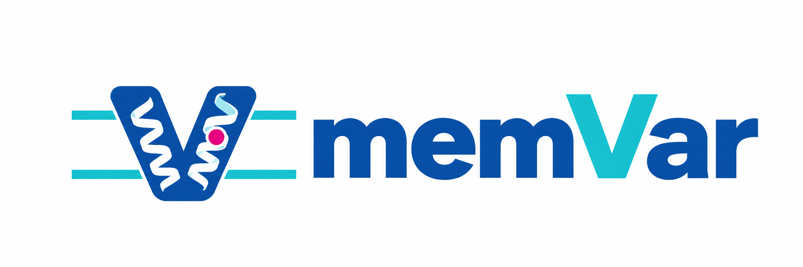

  

# memVar · Human membrane protein variants

**面向人类膜蛋白的变异与多来源证据数据库。**

memVar 将膜蛋白的序列、膜拓扑、三维结构、遗传变异和生物学背景组织到统一的蛋白页面中。研究者可以从基因或蛋白出发，定位感兴趣的变异，结合功能位点、组织表达、调控关联及疾病证据理解其背景，并追溯原始数据来源。

## 在 memVar 中可以探索什么？

| 内容 | 主要功能 |
| --- | --- |
| 蛋白概览 | 查看蛋白身份、膜分类、功能注释、细胞定位、GO 与 Reactome 通路 |
| 膜特征 | 浏览跨膜区段、拓扑注释、结构中的膜接触观察及 DeepTMHMM2 预测 |
| 序列与结构 | 在对齐的序列轨道中查看结构域、功能位点、翻译后修饰和保守性，并结合三维结构浏览残基 |
| 变异目录 | 检索与筛选变异，查看变异后果、来源记录、群体频率、ClinVar 分类及可选预测评分 |
| 表达与丰度 | 按 RNA 或蛋白测量浏览组织、细胞及肿瘤背景；PaxDB 保留原始 ppm 丰度，并将组织与细胞分开呈现 |
| 调控与预测 | 浏览 QTL 关联；先选 biosample 再选模态，将 AlphaGenome 参考预测与项目 SNV 的 AVI 分数放在共享基因组轴上比较，结合MANE Select CDS分段定位，并可叠加同模态信号 |
| 互作与疾病 | 查看蛋白互作、基因—疾病关系、表型及来源证据 |

## 从蛋白到证据

1. **查找蛋白**：通过基因名称、蛋白名称或 UniProt ID 搜索，例如 EGFR / P00533。
2. **了解背景**：在概览中查看膜特征、分子功能和细胞定位。
3. **定位变异**：结合序列轨道、三维结构和变异目录，检查位点及其注释。
4. **追溯证据**：展开来源记录，查看表达、疾病或预测结果的具体背景，并访问原始数据库。

## 多来源数据，保留各自含义

memVar 汇集 UniProt、GO、Reactome、Pfam、ClinVar、gnomAD、dbSNP、COSMIC、GTEx、Human Protein Atlas、PaxDB 等来源的相关信息。不同模块按适用对象组织记录，不同蛋白的覆盖范围可能不同。

- **来源可追溯**：保留来源名称、记录标识及适用的原始链接，支持查看具体证据。
- **注释与预测分开**：实验观察、来源注释和计算预测分别展示；不同预测工具保留各自的量纲与方向。
- **关联层次明确**：区分基因关联、蛋白身份关联和经过核对的序列位点映射。
- **保留测量背景**：组织、细胞、测量类型与数据集共同限定数值含义，缺失信息不作为零值。

## 关于本仓库

本仓库提供 memVar 网站的前端、查询 API、服务数据构建与导入代码。前端使用 React 和 TypeScript，API 使用 FastAPI，服务数据库使用 PostgreSQL。

- [本地部署与开发](docs/development.md)
- [服务数据说明](data/README.md)
- [技术文档索引](docs/README.md)

科研数据集、数据库文件及访问凭据不随源码发布；完整运行需要准备相应服务数据。仓库目前未声明统一开源许可证，第三方代码、素材及原始数据仍适用各自的许可和使用条款。
