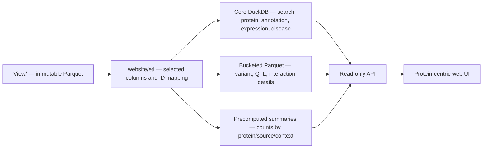

# 02. 初版数据子集与 ID mapping 合同

## 1. 数据规模与建模结论

本轮只读盘点得到的 active View 规模如下。行数是物理记录数，不等于独立生物学实体数。

| 层 | 物理表 | 记录数 | 磁盘约占用 | 对网站的直接结论 |
|---|---:|---:|---:|---|
| Basic info | 6 | 150,301 | 0.005 GiB | 可整体进入 core store |
| Annotation | 12 | 5,106,228 | 0.085 GiB | conservation 需区段读取 |
| PTM | 2 | 230,092 | 0.003 GiB | 可建立统一 site/interval 索引 |
| Variant | 5 | 79,408,765 | 1.571 GiB | 必须按蛋白建立 effect membership 与分桶 |
| Expression | 4 | 1,061,009 | 0.002 GiB | 可整体进入 core store，但量纲分开 |
| QTL | 28 | 201,019,565 | 1.560 GiB | 必须预聚合并按 accession 分桶 |
| Interaction | 3 | 845,429 | 0.022 GiB | 先做 source/context summary，明细分页 |
| Disease | 13 active | 858,400 | 0.014 GiB | assertion 与 ontology bridge 分开 |

其中 QTL 包含约 1.579 亿 QTLbase associations、3,973 万 GTEx significant pairs 与 341 万 eQTLGen cis-eQTL。任何请求时全表 join 都不属于可接受的初版实现。

## 2. 只读数据流



所有生成文件写到 `website/data/generated/`。构建脚本不得以任何模式打开 View 输出路径；不创建 SHA、QC JSON 或数据质量评分文件。

## 3. 全局实体与自然键

| 实体 | 网站主键 | 说明 |
|---|---|---|
| Protein page | `uniprot_accession` | canonical reviewed entry |
| Sequence | `sequence_id` | canonical 时通常等于 accession；isoform 保留完整 ID |
| Canonical residue | `uniprot_accession + sequence_version + position` | 1-based；必须与 residue 一致 |
| Feature interval | `accession + sequence_version + start + end + type + source` | start/end 为闭区间；modifier 非 EXACT 时标示不确定边界 |
| Genomic variant | `variant_key` | 当前为 GRCh38-style normalized key；页面仍显示 build |
| Variant protein effect | `variant_key + accession + isoform_id + consequence + HGVSp` | 一变异可对应多蛋白、多 isoform |
| Disease assertion | 来源原生 assertion/report key | 不构造跨来源“唯一结论” |
| QTL detail | 来源字段组合 | 不假设不同来源共享统一 variant key |
| Interaction evidence | 数据库原生 interaction/evidence ID + context | membership row 不等于 unique PPI |

## 4. 网站派生表

### 4.1 Search 与 protein core

#### `protein_search_index`

来源：

- `Basic_info/protein_basic.parquet`
- `Basic_info/protein_gene_name.parquet`
- `Basic_info/gene_identifier_bridge.parquet`
- `Basic_info/transcript_identifier_bridge.parquet`
- `Basic_info/protein_isoform.parquet`

字段：

```text
search_text, normalized_text, identifier_type, identifier_database,
uniprot_accession, display_label, match_priority
```

同一个 `normalized_text` 可对应多个 accession，全部保留。大小写规则：accession/稳定 ID 大小写不敏感但精确匹配；gene alias 统一 uppercase 作为检索键，同时保留原显示文本。

#### `protein_overview`

从 `protein_basic` 选择：

```text
uniprot_accession, entry_name, protein_name, gene_symbol,
canonical_length, protein_existence, annotation_score,
membrane_class, all_class_labels,
transmembrane_count, intramembrane_count,
lipidation_count, lipidation_anchor_match_count
```

`topology_ids`、`keyword_evidence_ids`、`peripheral_go_ids` 暂不进入首屏响应；如需要解释膜分类，可在 secondary detail API 中返回。

### 4.2 Basic annotation

| 派生表 | View 来源 | 初版字段/规则 |
|---|---|---|
| `protein_identifier` | gene/transcript bridges、gene names、isoform | 保留 source ID、base/full/version、alias type、accession/isoform |
| `go_summary` | `go_mf_bp_cc_membrane` | MF/BP/CC 三组 compact labels |
| `go_evidence` | `go_annotation` | 每条 GO annotation：`go_evidence_id`、accession、GO ID/name/aspect/namespace、qualifier、`is_negated`、evidence code、reference、with/from、assigned_by、extension、date；默认只显示非 negated |
| `reactome_membership` | `reactome_pathway_membership` | accession、pathway ID/name/url、evidence codes/count |
| `subcellular_location` | `uniprot_subcellular_location` | location/topology/orientation ID 与 name；大块 evidence JSON 初版不进默认响应 |

Reactome hierarchy 用于去除首页重复路径和构建展开树，但不把 parent 与 child membership 混成同一事实。

`go_evidence` 是逐条 annotation 事实，而不是 GO enrichment 或术语重要性表。其自然显示粒度为 accession + GO term 的汇总，只有用户展开术语后才分页读取 annotation rows。`is_negated=true`（例如 qualifier 中的 `NOT`）不能混入默认正向浏览；API 默认排除，并将该筛选状态显式返回。`go_evidence_id` 仅是当前不可变生成 build 内的 keyset 分页身份，不替代来源注释身份，也不承诺跨 release 稳定。

### 4.3 Sequence、domain、site 与 conservation

| 派生表 | View 来源 | 处理 |
|---|---|---|
| `protein_sequence` | `protein_sequence` | 全列；默认只取 `is_canonical=true` |
| `feature_interval` | UniProt general feature + PTM feature | 统一 schema，增加 website-only `track_group`；保留 modifier 与 coordinate basis |
| `covalent_pair` | `uniprot_covalent_structure` | start/end 作为两个配对端点，禁止画成整段填色 |
| `pfam_interval` | `pfam_domain_membrane` | 使用 env_start/env_end 作为展示边界；保留 Pfam ID/description/score |
| `ptm_site` | `dbptm_site_evidence` | accession、sequence version、position、residue、type、PMID、evidence count |
| `conservation_tile` | `conservation_site` | 保留 residue、JSD、entropy、WT frequency、gap、occupancy、confidence；按 accession/区段取值 |

`feature_interval.track_group` 建议分类：`topology`、`domain_region`、`secondary_structure`、`functional_site`、`ptm`、`other`。这是展示分类，不改变 View 的 feature type。

现有 general feature 中有少量缺少 start/end 的记录：它们保留在详情数据中，但不进入坐标轨道。保守性色标初版固定使用一种主指标（建议 JSD），其他指标只在 tooltip 中给出，避免同一 residue 同时承担多个颜色语义。

### 4.4 Variant

#### 为什么不能只按 `represent_variant.uniprot_accession` 查询

`represent_variant.parquet` 是 31,044,896 个 unique `variant_key` 的一变异一行宽表；它只为每个 variant 选择一个 canonical/alternative 代表蛋白。一个变异存在多个合法蛋白效应时，其他效应仍在 `isoform_view.parquet`。因此蛋白页若只过滤代表表，会漏掉非代表但合法的 protein membership。

#### `variant_core`

来源：`represent_variant.parquet`。保留现有 28 列，用作变异级事实：坐标、allele、source、频率、AlphaMissense、代表 consequence、gene/ID 等。`database_source` 拆成 source badges 仅用于显示，原值保留。

#### `variant_protein_effect`

来源：`isoform_view.parquet`，保留：

```text
variant_key, uniprot_accession, uniprot_isoform_id,
is_uniprot_canonical, Consequence, HGVSp, Codons, transcript_ids
```

增加 website-only 字段：

```text
effect_scope, protein_start, protein_end, ref_aa, alt_aa,
site_parse_status, is_representative_effect
```

- `effect_scope` 只取 `canonical` 或 `isoform`；
- 源表 `is_uniprot_canonical` 是 `true/false/NULL` 字符串，导入时规范成 tri-state；NULL 不擅自归为 false；
- 从 HGVSp 解析单点、range、stop、frameshift 等位置；解析失败仍留在表格，但不画入序列；
- canonical site marker 必须满足 canonical flag、位置范围和参考氨基酸一致；
- 不建立 isoform 到 canonical 的 offset 投影；
- `is_representative_effect` 通过 variant_key 与 `represent_variant` 的 accession/HGVSp 比较得到。

#### Source branches

- `variant_clinvar`：完整保留 branch 9 列，按 `variant_key` 连接；可有多条 RCV/phenotype。
- `variant_cosmic`：完整保留 branch 4 列，按 `variant_key` 连接；sample count 不解释为癌种特异频率。
- gnomAD 与 dbSNP：分别来自 core 的 frequency/`Existing_variation`，不伪造 source branch。

`MaveDB` 初版只预留独立 branch。其大量 assay-specific score 列不能横向比较；在没有冻结通用字段和 construct-to-canonical 规则前，不并入主 variant table。

### 4.5 Expression

四张表已经足够精简，初版全列使用，但 API 按 modality 分组：

| Modality | 值 | 单位/类别 | 缺失处理 |
|---|---|---|---|
| HPA RNA | `normalized_expression_ntpm` | nTPM | NULL 显示为空，不作 0 |
| HPA MS | `protein_intensity` | source intensity | NULL 显示为空，不作 0 |
| HPA IHC | `staining_level` | categorical | 同时展示 reliability；cell type 在下钻中显示 |
| PaxDB | `abundance_ppm` | ppm | 按 dataset/organ 展示 |

HPA 经 `ensembl_gene_id → gene_identifier_bridge → accession`；PaxDB 已有 accession。初版保留来源 tissue/organ 原名，不自动声称 HPA tissue 与 PaxDB organ 等价。

可以增加网站专用 `tissue_display_crosswalk(source, source_tissue, display_label, body_system)`，仅用于排序、分组和统一大小写；它不得把不同粒度术语自动合并为同一测量。原始 source tissue/organ 始终随值返回。

### 4.6 QTL

建立两级产物：

#### `qtl_summary`

```text
uniprot_accession, source_database, qtl_type,
tissue_or_context, population, record_count,
distinct_variant_or_locus_count
```

映射路径：

- GTEx：`ensembl_gene_id/gene_symbol → gtex_gene_protein_bridge → accession`；
- QTLbase：`gene_symbol → qtlbase_gene_protein_bridge → accession`；
- eQTLGen：`ensembl_gene_id → Basic_info/gene_identifier_bridge → accession`。

#### `qtl_detail_*`

保持三类来源各自 schema，避免造一个大量 NULL 的超宽表。API 统一的最小显示字段为：source、type、tissue、gene/phenotype、variant/locus、genome build、P value；GTEx 补 slope/SE/AF，QTLbase 补 population/sample/publication/context，eQTLGen 补 Z/FDR/sample/cohort。

QTLbase 的 locus 没有 REF/ALT/rsID，不能与 `variant_key` 自动等同；eQTLGen 是 GRCh37；GTEx 是 b38。build 必须随每行返回。

### 4.7 Interaction

#### `interaction_summary`

```text
uniprot_accession, source_database, context_class, context,
interaction_category, evidence_record_count,
distinct_native_interaction_count
```

#### BioGRID 明细节选

保留 native interaction ID、A/B GeneID 与 symbol、A/B Swiss-Prot、TaxID、experimental system/type、throughput、publication、score、modification、qualifications、mapped A/B GeneID、project context/class。

映射：mapped A/B GeneID 分别连接 `gene_identifier_bridge(identifier_database='GeneID')`。同一页面请求中标明当前蛋白位于 A、B 或两端。

#### IntAct 明细节选

保留 A/B raw ID 与 mapped accession、alias、participant type/TaxID、detection method、interaction type、publication、native interaction ID、confidence、expansion method、negative、features、host、context/class。

`intact_mutation_effect` 作为 Interaction detail 的独立 subsection，不混入一般 edge count。

两张 interaction 表的部分 mapped endpoint 使用空字符串表示缺失；导入网站层时统一为 NULL，不能把空字符串作为一个可计数的 partner ID。

### 4.8 Disease

直接展示表：

- `clingen_gene_disease_validity`
- `clingen_dosage`
- `gencc_assertion`
- `omim_gene_disease`

辅助展开：`hpo_gene_disease → hpo_disease_phenotype → hpo_term`。

隐藏桥：MONDO term/xref/is-a/category rollup 与 MedGen bridge。只有 `mondo_xref.eligible_for_unique_merge=true` 可用于自动同一化；其他只提供导航。ClinGen quarantine 表不进入网页。

`mapped_accessions` 是分号分隔的一对多关系，拆分为 child rows，但保留原 assertion 一次；不复制成多个看似独立的疾病结论。

## 5. 分桶与查询布局

建议生成：

```text
website/data/generated/
├── memvar_core.duckdb
├── variant/
│   ├── core/accession_bucket=000..127/*.parquet
│   ├── effect/accession_bucket=000..127/*.parquet
│   └── source/{clinvar,cosmic}/accession_bucket=.../*.parquet
├── qtl/source=.../type=.../accession_bucket=.../*.parquet
├── interaction/source=.../accession_bucket=.../*.parquet
└── summaries/*.parquet
```

`accession_bucket` 使用固定、可复现的非加密哈希分为 128 桶；桶内按 accession 和常用排序键排序，使 Parquet row-group statistics 能跳过无关数据。这里的哈希只用于分桶，不作为来源校验或 SHA 产物。

## 6. 已知数据缺口与展示边界

1. View 没有 UniProt free-text Function comment；Basic info 只能基于现有结构化注释。
2. `represent_variant` 没有显式 protein position；网站必须从 protein-specific HGVSp 派生 site index。
3. View 没有统一 HPA/PaxDB tissue ontology；初版保留来源词汇，不能用字符串相等声称同组织。
4. Interaction active View 没有 edge summary；网站生成的 summary 必须清楚标注 evidence vs distinct native ID。
5. QTLbase 不是统一 significant set，且部分候选记录可重复；计数标签必须使用 associations/records。
6. ClinGen、GenCC、OMIM 的证据语义不同；疾病数量不能作为一致性评分。
