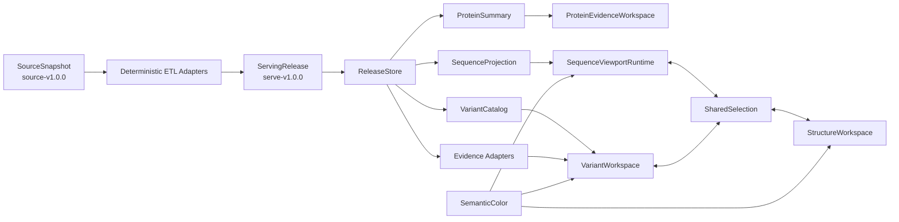

# 17. memVar v1.0 预发布数据整合与架构重构计划

> 状态：In progress；首批 vertical slice 与外置 staging 已开始，尚未签发 v1.0  
> 编制日期：2026-08-25  
> 代码根目录：`/home/xuyzh/memVar/website`  
> v1 数据目标盘：`/media/xuyzh/Newsmy`  
> 目标盘 UUID：`9894627C94625D2E`  
> 目标数据根：`/media/xuyzh/Newsmy/memvar-data`  
> 目标数据版本：`data-v1.0.0`  
> 已确认存储决策：保留 NTFS3；稳定挂载；顺序传输约 150 MB/s  
> 代码远端：`https://github.com/PuppetZhou/memVar.git`（public，当前为空）  

## 0. 计划结论

memVar 已经进入“冻结科学数据、继续优化呈现”的阶段。预发布不应再把它当作仍在持续采集的研究脚本集合，而应当把它收敛为一个**版本固定、只读、可重建、可回滚的科学数据产品**。

本计划作出以下核心决策：

1. `/media/xuyzh/Newsmy` 是唯一的新目标盘；位于 `/media/xuyzh/Newsmy1` 的 **2,764,008,820,308 B AlphaGenome 全量原始数据要完整迁入** `Newsmy` 的 `source-v1.0.0`。`Newsmy1` 只是只读迁移源。
2. 代码、测试、文档和 ETL 实现继续留在 `/home/xuyzh/memVar/website`，并发布到 `PuppetZhou/memVar`；目标盘只保存真实数据与数据发布元信息，真实数据不进入 GitHub。
3. 把版本拆成三个概念：不可变的 `source-v1.0.0`、可重建的 `serve-v1.0.0`、独立迭代的应用版本。后续 UI 变化不复制 2.764 TB 原始 AlphaGenome。
4. 保留 DuckDB + Parquet 的只读分析架构，不迁移到 PostgreSQL、Elasticsearch、GraphQL 或微服务。当前问题来自数据路径、请求形态和浏览器渲染，不是数据库引擎能力不足。
5. 新增的 2410 万行 gnomAD v4.1 数据必须替换旧的逐变异在线试验流程；在此之前不能签发完整的 `data-v1.0.0`。
6. Sequence 卡顿首先通过深化 `SequenceViewportRuntime` Module 解决：隔离瞬态 hover、按帧调度、稳定投影、按视口/LOD 取数，并保留“全部 track 开启”作为强制验收场景。
7. Variant 改为 summary-first 的 `VariantCatalog` Module：统计面板 → 筛选 → 条目列表 → 独立证据抽屉；ClinVar、gnomAD、COSMIC、stability 不再共用一个宽而可空的响应。
8. Sequence 与 Structure 的既有科学配色被冻结；其余界面改为中性 UI 色、来源分类色、科学方向色三层语义 token。
9. 实际迁移必须使用同盘 staging、完整只读校验和原子切换。首次切换不删除任何源数据。
10. 目标盘固定保留 NTFS3；Implementation 不依赖 symlink、POSIX owner/mode 或运行时目录扫描，并在真实机械盘上做冷/热性能验收。

### 0.1 已确认的数据流

| 数据 | 是否迁入 Newsmy | source-v1.0.0 | serve-v1.0.0 | 是否进入 GitHub |
|---|---|---|---|---|
| AlphaGenome 全量原始数据（2.764 TB） | **是，完整迁移** | `sources/source-v1.0.0/alphagenome/alphagenome_1mb_by_gene/` | 不直接在线读取原始 HDF5 | 否 |
| AlphaGenome 当前派生展示数据（约 53.38 GB） | **是** | 不重复放入 source | `serving/serve-v1.0.0/assets/alphagenome/` | 否 |
| gnomAD v4.1 宽表（24,106,956 行） | **是，必须纳入 v1** | `sources/source-v1.0.0/view/variant/gnomad_v41_population_frequencies.parquet` | `facts/variant-population-frequency/variant_bucket=...` | 否 |
| website 代码、ETL、tests、docs | 不放数据盘 | 不适用 | 不适用 | **是** |

因此，“AlphaGenome 原始数据不迁移”与“gnomAD 只保留在 View、不进入产品”都不是本计划的含义。

### 0.2 2026-08-25 执行快照

以下是可验证的当前进度，不代表最终发布完成：

- `website` 已初始化为本地 `main` Git worktree，并连接空的 public 远端；根级忽略规则已阻止 generated 数据、依赖、构建产物、运行时文件和真实二进制数据进入 Git。首个 commit/push 仍等待本轮测试与 staged 审计完成。
- `ReleaseStore` 已覆盖 core、M2/M3/M4、DE、structure、AlphaGenome 与 anatomy 等全部运行时 Module；旧的细粒度数据路径 fallback 已删除，启动会校验 UUID、`RELEASE.json`、`_READY` 与全部必需资产。
- 新 gnomAD Adapter 已离线处理全部 24,106,956 行，在目标盘 staging 生成 256 个稳定 hash bucket；HTTP/UI 使用 AF-only 合同，Exome、Genome、Joint 独立，AC/AN 等缺失字段明确为 unavailable。
- 目标盘 staging 已包含 core/variant catalog、Sequence/Variant facts 与全量 gnomAD serving，共用路径为 `memvar-data/.staging/serve-v1.0.0-foundation`；它仍是候选目录，不是 `serving/serve-v1.0.0`。
- View 的 active v1 数据已复制到 `memvar-data/.staging/source-v1.0.0/view`：76 个 Parquet 与 15 个既有说明/QC 文件，共 4,078,853,538 B；源/目标路径、字节、schema、行数与 row group 校验通过。
- 差异表达重建输入（1,175 Parquet）、ThermoMPNN 最终结果（69 Parquet）和 AlphaFold v6 原始 tar 已进入 source staging 并通过相对路径、字节与格式验收；无网站消费者的本地 AlphaGenome 开发输出明确排除。
- AlphaGenome 全量原始目录已从 `Newsmy1` 启动可续传只读复制，目标为 `memvar-data/.staging/source-v1.0.0/alphagenome/alphagenome_1mb_by_gene.partial`；复制完成和内容验收前不会改名为最终 staging 目录。
- Sequence 首轮止卡优化已完成：残基 hover 留在局部 viewport Implementation，pointer move 按动画帧合并，Canvas TrackAdapter 与选择回调稳定化；生产 trace 和真实 HDD 预算仍待验证。
- Protein Overview 已设置 10 个 lazy Module 边界：身份摘要立即呈现，其余 11 个密集/请求型子模块只在进入 600 px 预取区或被 hash/deep link 指向时挂载；首屏冷启动 fan-out 从 11 个密集 child 降为 0。
- Variant Summary 已完成后端统计 Interface 与前端 summary-first 面板；Variant facts/effects/ClinVar/COSMIC/stability 也已拆为 source-scoped EvidenceAdapter，旧 combined detail Interface 已删除。
- 完整 test release 上已通过 backend 104 项、ETL 21 项、frontend 93 项、TypeScript、production build 与 same-origin full-stack smoke；其余 serving 资产迁移、AlphaGenome 全量原始复制、真实 HDD 性能验收、原子签发与切换尚未完成。

## 1. 范围与非目标

### 1.1 本计划覆盖

- v1.0 全部源数据与当前 serving 数据的盘点、分层、目录规范和迁移运行手册。
- View、AlphaGenome、结构、ThermoMPNN、差异表达输入及当前 generated 数据的发布归属。
- 新 gnomAD v4.1 全量频率表的离线接入设计。
- 运行时数据根、启动校验、缓存、可观测性与回滚设计。
- Sequence / Variant 性能重构。
- Variant 统计面板、证据设计、现代 UI 和新配色系统。
- CATVariant 可借鉴部分、不可直接照搬部分及量化验收标准。

### 1.2 本计划不覆盖

- 不改变或重新解释原始科学数据。
- 不把不同蛋白 isoform 的位置投影到 canonical 坐标。
- 不合并 ClinVar assertion 为自创的“共识致病性”，不建立综合优先级分数。
- 不把 gnomAD 频率解释为致病性。
- 不在本轮复制、移动、删除或重压缩 TB 级数据。
- 不承诺旧内部 HTTP Interface 或旧 ETL 输出布局的长期兼容；新消费者切换后应删除旧路径。

## 2. 已核验的 v1 基线

以下数字来自 2026-08-25 的只读盘点；迁移执行前必须重新生成一次瞬时基线，避免把编制计划后的变化误当成 v1。

| 资产 | 位置 | 已核验规模 | v1 角色 |
|---|---|---:|---|
| 目标盘 | `/media/xuyzh/Newsmy` | 约 5.5 TiB 可用；NTFS3；USB 机械盘；实测顺序传输约 150 MB/s | 新数据根 |
| View | `/home/xuyzh/memVar/View` | 4,189,489,056 B；118 文件；82 Parquet | 规范化源表候选 |
| 当前 serving | `/home/xuyzh/memVar/website/data/generated` | 56,908,194,440 B；37,285 文件 | 可重建展示层 |
| AlphaGenome 全量原始数据 | `/media/xuyzh/Newsmy1/alpha-predict/alphagenome_1mb_by_gene` | 2,764,008,820,308 B | 只读迁移源 |
| AlphaGenome serving | `website/data/generated/alphagenome` | 约 53.38 GB；7,746 tile bundle | 展示资产 |
| 差异表达输入 | `/home/xuyzh/memVar/Mapping-data/GEN/results/by_dataset` | 1,597,078,095 B | 重建输入 |
| ThermoMPNN | `/home/xuyzh/memVar/MPNN-predict/result` | 183,573,526 B | 重建输入 |
| AlphaFold v6 archive | `/home/xuyzh/memVar/structure/UP000005640_9606_HUMAN_v6.tar` | 5,177,506,304 B | 原始结构资产 |
| AlphaGenome 本地校验输出 | `/home/xuyzh/memVar/alpha-predict/outputs` | 321,995,477 B | 校验/参考输入 |

预计 v1 源快照加当前 serving 约 2.83 TB，占目标盘约 47%。这给单份原始快照和多个约 57 GB 的 serving 发布留下空间，但不适合长期在目标盘内保留两份完整 AlphaGenome 原始副本。

### 2.1 新 gnomAD 文件

`/home/xuyzh/memVar/View/Variant/gnomad_v41_population_frequencies.parquet` 已核验为：

- 527,679,726 B；24,106,956 行；30 列；96 row groups；ZSTD。
- `variant_id` 全部非空且唯一，可精确映射到 `represent_variant`。
- 29 个 ancestry AF 字段，覆盖 Exome、Genome、Joint 三种 callset。
- AF 非空值均为有限数且位于 `[0, 1]`。
- 文件只有 AF，没有 AC、AN、homozygote 或 hemizygote；缺失字段不得伪造为 0。
- `represent_variant` 中约 6,937,940 个键没有该频率，应在产品中明确显示 unavailable。

当前代码没有引用该文件。旧 `etl/build_variant_population_frequency.py` 仍经外部 GraphQL 逐个获取有限变异，当前 serving 只物化了 24 个变异，因此它不是 v1 的可发布实现。

### 2.2 当前 serving 组成

当前 `data/generated` 中主要资产为：

| Module 数据 | 大小或数量 | 备注 |
|---|---:|---|
| AlphaGenome | 53,378,264,415 B；23,240 文件 | 7,746 份 tracks/junctions/contacts |
| QTL | 1,554,681,666 B | Parquet |
| Structure | 829,896,693 B | 8,837 个 `.pdb.gz` 等 |
| Variant | 753,187,667 B | DuckDB + Parquet |
| Sequence | 184,365,415 B | DuckDB + Parquet |
| Differential expression | 80,164,274 B | DuckDB + Parquet |
| 总格式 | 28,261 Parquet；6 DuckDB；8,837 `.pdb.gz` | 当前展示层 |

### 2.3 当前软件与调用链

- Frontend：Next 16.3.0、React 19.2.8、TypeScript。
- Backend：FastAPI 0.136.0、Pydantic 2.12.3、DuckDB 1.5.3。
- Structure：Mol*；AlphaGenome 图表：ECharts；Sequence 密集点：Canvas/SVG 混合。
- `/protein/[acc]` 当前是纯 client page；protein overview 返回后一次性挂载几乎所有下游 Module，形成请求 fan-out。
- 浏览器经 Next rewrite 访问 FastAPI；每个请求创建一个只读 DuckDB connection，然后读取 DuckDB 或按 accession/bucket 分区的 Parquet。
- `start-local.sh` 和多个 builder 仍硬编码 `website/data/generated`，没有统一的数据根。

### 2.4 GitHub 与本地 Git 状态

- [PuppetZhou/memVar](https://github.com/PuppetZhou/memVar) 已存在、为 public repository；远端仍为空，尚无首个 commit。
- `/home/xuyzh/memVar/website` 已初始化为 `main` Git worktree，并配置该 GitHub 仓库为 `origin`；尚未 commit/push。
- `website` 根目录已建立项目级 `.gitignore`，当前会排除 `data/generated`、真实数据库/科学数据二进制、`node_modules`、`.next*`、`.runtime` 和测试缓存。
- 排除 generated、依赖、构建缓存和运行时截图后，网站代码、文档与轻量配置约 5.7 MB，适合普通 Git。
- 上层目录含 AlphaGenome、AlphaGenome Research、ThermoMPNN 等独立第三方 Git worktree；它们不得作为嵌套仓库整体加入 memVar。只提交 memVar 自己的调用代码和依赖声明。

## 3. 预发布阻断项

以下项目全部关闭前，不签发 `data-v1.0.0`：

| ID | 阻断项 | 关闭条件 |
|---|---|---|
| B-01 | 新 gnomAD 未进入真实产品链 | 全量离线 Adapter、serving 分区、HTTP Interface 和 UI 均通过验收；运行时零外部请求 |
| B-02 | 数据路径分散 | 所有运行时 Module 经唯一 `ReleaseStore` 解析路径，启动时校验 UUID、release 和必需资产 |
| B-03 | 代码尚无可识别版本 | 初始化 `website` Git worktree，只提交代码资产，并在 public 远端冻结生成 v1 serving 的 commit |
| B-04 | 只有一块新盘不等于备份 | 首次切换后保留所有原始位置；另行制定第二份独立备份策略 |
| B-05 | Sequence 全 track 无性能合同 | 建立 production baseline 并满足第 13 节预算 |
| B-06 | Variant 统计语义未固定 | 冻结 isoform、consequence、ClinVar 计数 grain 和重叠规则，并建立守恒测试 |

NTFS3 选择已经关闭，不再是设计阻断项；机械盘冷/热性能仍属于发布验收条件。

## 4. 目标数据发布合同

### 4.1 三种独立版本

1. **Source snapshot：`source-v1.0.0`**  
   保存不可变的 v1 科学输入。它不随 UI 迭代改变，也不因为展示层优化而复制。
2. **Serving release：`serve-v1.0.0`**  
   保存由 source snapshot 确定性构建的 DuckDB、Parquet、索引、聚合和结构资产。后续可建立 `serve-v1.0.1`，但始终引用同一个 `source-v1.0.0`。
3. **Application release**  
   代码仍在本地 Git 中独立版本化；部署配置固定引用一个 serving release，不跟随可变目录。

这种拆分保证后续“只优化展示和 UI”时不会重复 2.764 TB 原始 AlphaGenome。

### 4.2 推荐目录

```text
/media/xuyzh/Newsmy/memvar-data/
├── .staging/
│   ├── source-v1.0.0.<transaction-id>/
│   └── serve-v1.0.0.<transaction-id>/
├── sources/
│   └── source-v1.0.0/
│       ├── RELEASE.json
│       ├── _READY
│       ├── view/
│       │   ├── basic-info/
│       │   ├── annotation/
│       │   ├── ptm/
│       │   ├── variant/
│       │   ├── expression/
│       │   ├── qtl/
│       │   ├── interaction/
│       │   └── disease/
│       ├── alphagenome/
│       │   └── alphagenome_1mb_by_gene/
│       ├── differential-expression/
│       ├── thermompnn/
│       ├── alphafold-v6/
│       └── validation-inputs/
└── serving/
    └── serve-v1.0.0/
        ├── RELEASE.json
        ├── _READY
        ├── catalog/
        ├── facts/
        │   ├── sequence/
        │   ├── variant/
        │   ├── variant-population-frequency/
        │   ├── expression/
        │   ├── qtl/
        │   ├── interaction/
        │   └── disease/
        ├── summaries/
        │   ├── protein/
        │   ├── sequence/
        │   └── variant/
        └── assets/
            ├── structure/
            ├── alphagenome/
            └── anatomy/
```

本地部署配置保存于代码目录，例如 `website/config/data-release.env`，只包含：

```dotenv
MEMVAR_DATA_MOUNT=/media/xuyzh/Newsmy
MEMVAR_DATA_UUID=9894627C94625D2E
MEMVAR_SOURCE_RELEASE=source-v1.0.0
MEMVAR_SERVE_RELEASE=serve-v1.0.0
```

不使用 NTFS symlink 作为 `CURRENT`。应用启动时解析并固定一次完整路径，请求处理中不得跟随可变指针。

### 4.3 `ReleaseStore` Module

`ReleaseStore` 是唯一的数据路径 Interface，隐藏磁盘布局这一 Implementation。它负责：

- 校验 mountpoint 对应 UUID，而不只比较名称 `Newsmy`。
- 拒绝没有 `_READY` 或 `RELEASE.json` 的 release。
- 返回 typed relative paths，例如 `variant_catalog`、`sequence_projection`、`alphagenome_assets`。
- 确保路径仍位于 release root 内，拒绝 path traversal、空目录自动创建和隐式 fallback。
- 将 release ID 注入日志、缓存键和响应元信息。
- 为测试提供临时 root Adapter；现有细粒度 `MEMVAR_M2_ROOT` 等只保留为测试覆盖，不再作为正常部署配置。

其 Depth 来自一个很小的 Interface 隐藏 UUID、release 校验、路径规则和多个底层格式；其 Leverage 是所有运行时与 ETL Module 同时受益；其 Locality 是路径规则只在一处改变。

### 4.4 统一格式的含义

“统一”是统一发布封装、命名、grain、缺失语义和寻址方式，而不是强行把所有科学对象转成 Parquet。

| 数据类型 | source snapshot | serving release | 规则 |
|---|---|---|---|
| 表格事实 | 原始/规范化 Parquet 原样保存 | Parquet + ZSTD | serving 使用 snake_case；明确主键、grain、单位、genome build |
| 小型 catalog/索引/聚合 | 不强制 | DuckDB，只读打开 | 不保存大 BLOB；不承担在线写事务 |
| AlphaGenome dense tensor | HDF5 原样保存 | 预计算 Parquet/图表资产 | source 不为“统一格式”而重写 2.7 TB |
| 蛋白结构 | 原始 tar | `.pdb.gz` + catalog | 浏览器按 accession 精确寻址 |
| 发布元信息 | UTF-8 JSON | UTF-8 JSON | UTC、RFC 3339、release-relative paths |

大扫描表的目标文件通常为 128–512 MiB；点查 bundle 可以更小，但必须通过 catalog 精确寻址，不能让请求扫描目录。所有数值字段必须区分 `0`、`null/unavailable` 和“不适用”。

### 4.5 允许与禁止的发布元信息

`/home/xuyzh/memVar/website/AGENT.md` 是只读 agent 约束文件，不做修改。它要求所有检查与抽象都对应具体需求。2.83 TB 数据经 USB 迁移存在现实的中断或传输错误风险，因此只在迁移事务中做必要校验：

- 允许：release ID、schema version、dataset ID、source release、row grain、主键、坐标体系、单位、记录数、文件数、逻辑字节数、必需相对路径、已知排除项、构建命令和完成状态。
- 允许：迁移过程中执行临时 checksum/byte comparison；成功后不把 checksum 清单作为产品资产持久化。
- 允许：迁移已有且属于源数据合同的 QC/manifest，并在 Interface tests 中做小型断言。
- 禁止：新建永久逐文件 SHA inventory、独立质量报告、综合质量分、把 hash 当作 scientific provenance。
- 禁止：在发布文件中记录 `/home/xuyzh/...` 或旧磁盘绝对路径。

`RELEASE.json` 最小示意：

```json
{
  "release_id": "serve-v1.0.0",
  "source_release_id": "source-v1.0.0",
  "schema_version": 1,
  "status": "immutable",
  "created_utc": "2026-08-25T00:00:00Z",
  "required_assets": [
    "catalog/core.duckdb",
    "facts/variant",
    "facts/variant-population-frequency",
    "assets/alphagenome"
  ],
  "datasets": [
    {
      "dataset_id": "gnomad-v4.1-population-af",
      "record_grain": "one variant per row with 29 ancestry AF columns",
      "row_count": 24106956,
      "known_exclusions": ["AC", "AN", "sex groups", "HGDP", "1000 Genomes"]
    }
  ]
}
```

### 4.6 GitHub 代码发布合同

GitHub 是 application/code release，不是 data release。首次 `git add` 之前必须先建立根级忽略规则，并审查 staged files。

应提交：

- `AGENT.md` 原样保留。
- `README.md`、`backend/`、`etl/`、frontend 源码、tests、docs、package/lock files。
- 不含凭据的轻量配置、schema、release manifest 示例和小型测试 fixture。

不得提交：

- `/media/xuyzh/Newsmy` 或 `Newsmy1` 中的任何 source/serving 文件。
- `View`、`website/data/generated`、528 MB gnomAD Parquet、DuckDB、HDF5、PDB/TAR 和真实请求缓存。
- `node_modules`、`.next*`、`.runtime`、`__pycache__`、`.pytest_cache`、日志和本地环境文件。
- 嵌套第三方 Git worktree。

普通 Git 对单文件超过 100 MiB 有硬限制，GitHub 也建议将 programmatically generated files 存在 Git 外；本项目不使用 Git LFS 承载 TB/GB 级数据库。[GitHub repository limits](https://docs.github.com/en/repositories/creating-and-managing-repositories/repository-limits)

## 5. 数据迁移运行手册

### G0：已确认的 NTFS3 约束

目标盘已稳定以 NTFS3 挂载，UUID 为 `9894627C94625D2E`，实测顺序传输约 150 MB/s。Implementation 采用以下固定规则：

- 目录切换使用同盘 rename + `_READY` 发布 Seam。
- 不依赖 symlink、POSIX owner/mode 或每请求目录扫描。
- AlphaGenome 与 Parquet 均通过 catalog 精确寻址。
- 2.83 TB 按 150 MB/s 的单次理论传输约 5.2 小时；大量小文件、metadata 和校验会延长实际时间，因此迁移必须可恢复并显示进度。
- 冷盘与热缓存性能都在该真实挂载上验收，不再保留另一种文件系统 Implementation。

### M0：冻结候选与治理先行

1. 暂停所有写入 v1 输入的 ETL；网站保持只读可用。
2. 读取并遵守 `website/AGENT.md`，不修改该文件。
3. 记录 release layout、NTFS3 mount identity、cache semantics、selection ownership 和统计 grain。
4. 先建立根级忽略规则并审查 staged files，再将 `website` 初始化为 Git worktree，连接 `PuppetZhou/memVar`，冻结生成 v1 serving 的代码 commit；不提交真实数据。
5. 刷新源注册表中 `source_release: not_recorded` 的项目；无法追溯时明确写 `unresolved` 和原因，不静默猜测。

退出条件：`AGENT.md` 未改变；代码 commit 可识别；Git staged/remote 中没有真实数据；没有 ETL 继续写入候选数据。

### M1：建立路径 Interface

1. 实现 `ReleaseStore` 和 ETL 对应的 `BuildPaths` Adapter。
2. 将 `start-local.sh`、backend 各 mart、structure、AlphaGenome、DE、anatomy 的默认路径改为从 release root 派生。
3. 所有 builder 只允许写入 `.staging/<release>.<transaction-id>`，禁止直接覆盖已发布目录。
4. 启动失败必须 fail closed：盘未挂载、UUID 不符、资产缺失时不得创建空 DuckDB 或回退到不完整数据。

退出条件：在临时目录中通过全部 path contract tests；观察期内可通过部署配置回滚旧 generated，观察期结束后删除该临时 rollback 路径。

### M2：定义 source snapshot 包含范围

| 原位置 | 迁移到 source | 处理规则 |
|---|---|---|
| `View/**/*.parquet` | 是 | 保留源逻辑与现有 schema；serving 再规范化命名 |
| View 中已有有效 QC/manifest | 是 | 只迁移已有合同资产 |
| View 中 `.py`、`.pyc`、`__pycache__`、日志、普通说明文档 | 否 | 代码与文档留本地 |
| View 中 backup/superseded/quarantine | 条件保留 | 标记为 archive，绝不自动进入 serving |
| AlphaGenome 全量 gene 目录 | 是 | 从 `Newsmy1` 只读复制；source 原样保存 |
| `GEN/results/by_dataset` | 是 | 差异表达重建输入 |
| `MPNN-predict/result/*.parquet` | 是 | 排除 log |
| AlphaFold v6 tar | 是 | 原始结构资产 |
| `alpha-predict/outputs` | 条件保留 | 仅纳入已被验证流程引用的输入/校验资产 |
| `website/data/generated` | 不属于 source | 进入 serving staging 或由 source 重建 |

退出条件：每一资产有 dataset ID、role（active/archive/validation）、grain 和目标相对路径。

### M3：复制到同盘 staging

1. 迁移程序在写入前校验目标 UUID、可用空间和目标 release 不存在。
2. 创建唯一 transaction staging；任何中断都不产生 `_READY`。
3. 先复制 `source-v1.0.0`，再复制或构建 `serve-v1.0.0`。
4. 使用可恢复的增量复制；不要通过 staging 后再复制一次形成第二份 2.8 TB 目标副本，最终使用同盘 rename。
5. 复制时记录进度日志到本地工作目录，不把旧绝对路径写入 release。

2.8 TB 经 USB 机械盘复制与一次完整顺序校验都可能分别持续数小时；执行时应作为可恢复的长任务监控，不使用不可恢复的一次性命令。

### M4：构建 serving release

1. 当前约 57 GB generated 可先作为“迁移前基准”，但最终 v1 必须由冻结代码与 source snapshot 重建或逐 Module 证明等价。
2. 新建 gnomAD 离线 Adapter 和 Variant Summary projection。
3. 生成 Sequence summary/window projection，消除 Structure 的重复 overview 请求。
4. 检查 AlphaGenome 7,746 tile 的 tracks/junctions/contacts 三件套；通过 catalog 精确定位。
5. 在机械盘上比较现有 AlphaGenome 小文件布局与 bucket/container Adapter；只有实测表明收益并通过语义等价后才重打包。

退出条件：运行时零外部数据请求；所有 serving 路径均为 release-relative。

### M5：校验 staging

校验分四层，任何失败都保持 staging，不切换：

1. **传输层**：源/目标文件数、总字节一致；执行 100% 临时 checksum/byte verification，但不保存永久 hash inventory。
2. **格式层**：所有 Parquet footer、DuckDB read-only、HDF5 open、JSON parse、gzip test、tar listing 通过。
3. **语义层**：主键、grain、范围、引用完整性和既有 manifest 断言通过；不生成新独立 QC 报告。
4. **产品层**：production build、backend tests、ETL contract tests、stack smoke、关键页面、冷/热性能预算全部通过。

### M6：原子签发与切换

1. 在 staging 中写完 `RELEASE.json`，最后写 `_READY`。
2. 同盘 rename 到 `sources/source-v1.0.0` 和 `serving/serve-v1.0.0`。
3. 先用外置 release 启动独立测试实例；通过后短暂停服务。
4. 原子替换本地部署配置中的 release ID，重启服务。
5. 启动日志明确记录 UUID、source release、serve release；首批 smoke 通过后恢复流量。

### M7：回滚与保留

- 回滚仅把本地部署配置切回旧的 `website/data/generated` Adapter 或上一个 serve release，然后重启。
- 首次切换至少观察 7–14 天；在此期间不删除 `View`、旧 generated 或 `Newsmy1` 中的 AlphaGenome 原始数据。
- 删除任何原始副本必须是单独的、明确批准的破坏性任务，并先证明存在第二份独立备份。
- 新硬盘是主存储，不自动等于备份。

## 6. gnomAD v4.1 的新 Serving Adapter

### 6.1 不采用长表爆炸

不把 24,106,956 × 29 个 AF 全量 unpivot 成约 7 亿行。推荐：

- source 中保留当前宽表原样。
- serving 按稳定 `variant_bucket=000..255` 分区，桶内按 `variant_id` 排序。
- 变异详情请求先验证该 variant 属于当前 protein，再定位一个 bucket 中的一行。
- `PopulationFrequencyAdapter` 在返回前把 29 个宽字段 reshape 为小型 callset/population 数组。
- Exome、Genome、Joint 保持独立，禁止求平均或覆盖。

256 桶是初始值，正式值由目标 HDD 上的点查/构建实测决定；bucket 规则必须稳定且由 ETL 与 backend 共用一份实现。

### 6.2 新 HTTP Interface

```text
GET /api/v1/proteins/{accession}/variants/{variant_key}/population-frequency
```

响应应明确：

```json
{
  "dataset": "gnomad_v4.1",
  "population_scope": "genetic_ancestry_group",
  "variant_key": "...",
  "callsets": [
    {
      "callset": "joint",
      "populations": [
        {"code": "afr", "label": "African/African American", "af": 0.00012}
      ]
    }
  ],
  "unavailable_fields": ["ac", "an", "homozygote_count", "hemizygote_count"]
}
```

必须满足：

- `af: 0` 与 `af: null/absent` 不同。
- 不把 AC/AN 伪造为 0。
- 不使用 population max 归一化条形长度；所有变异使用固定 log AF 轴并显示精确 AF。
- 删除旧在线脚本、外部 skill 路径、request cache 和 `not_materialized` 语义；新消费者迁移后不保留双实现。

## 7. 目标代码架构

### 7.1 当前主要结构问题

1. protein overview 返回后，一次性挂载 GO、Reactome、Sequence、Structure、Variant、Anatomy、Expression、QTL、AlphaGenome、Interaction、Disease，产生首屏后的请求 fan-out。
2. `sequence-explorer.tsx` 超过 1300 行，viewport、track 投影、瞬态 hover、URL selection、绘制和 legend 的 Locality 很弱。
3. Sequence 请求完整 `overview?bins=400`；Structure 为一个 density 又请求 `overview?bins=1`，后端仍重复读取全部 sequence 数据。
4. Variant options 每次扫描、列表又执行 exact count；打开任一非 gnomAD 证据分支会读取 effects、ClinVar、COSMIC、stability 全部分支。
5. 固定 v1 数据仍对 JSON 强制 `Cache-Control: no-store`；缺少 release-aware cache。
6. Pydantic 与手写 TypeScript 类型重复，已有 drift 风险；但在证据出现前不引入大规模 codegen。
7. 路径、selection、颜色与请求语义散落在多个 shallow Module 中。

### 7.2 目标 Module 图



### 7.3 深化候选

| Module | 小 Interface | 隐藏的 Implementation | 价值与顺序 |
|---|---|---|---|
| `ReleaseStore` | 由 release ID 取 typed asset | UUID、目录、DuckDB/Parquet、启动校验 | 最高优先；所有数据 Module 的共同 Seam |
| `ProteinEvidenceWorkspace` | accession、release、selection | summary-first、below-fold lazy mount、请求去重 | 首屏和请求 fan-out 的外层治理 |
| `SequenceProjection` | summary / window / density | DuckDB 查询、Parquet LOD、bins、缓存 | 消除重复 projection；为长蛋白提供有界响应 |
| `SequenceViewportRuntime` | viewport、enabled tracks、canonical selection | rAF、hover store、Canvas/SVG Adapter、memo、LOD | 直接解决全 track 卡顿；高 Leverage |
| `VariantCatalog` | summary、cursor page、filters | 预计算 facets、查询、计数 grain | 保证统计语义只在一处 |
| `EvidenceAdapter` | source-scoped evidence | ClinVar/COSMIC/gnomAD/stability 各自 schema 与读取 | 防止宽 join 和无关分支 I/O |
| `SharedSelection` | site/range/variant/evidence | URL hydrate、keyboard/touch、cross-view linking | 一个 owner，避免两个 UI Module 各自写 URL |
| `SemanticColor` | source/status/scale token | CSS values、legend、contrast、dark-mode 候选 | 保留科学语义并降低硬编码颜色漂移 |

删除测试：若删除这些 Module，会迫使多个 caller 各自复制路径解析、计数语义、selection 或 track 调度，它们因此值得成为 deep Module。Web Worker、OffscreenCanvas 和 WebGL 暂属 speculative；只有主线程重构后仍出现超过 50 ms 的 long task 才引入。

### 7.4 Protein workspace 加载顺序

1. Server-rendered identity/coverage shell：protein name、accession、canonical length、数据覆盖情况。
2. 首屏只发 summary 所需请求；Mol*、ECharts 不进入首屏 chunk。
3. below-fold Module 通过 IntersectionObserver 真正延迟 mount 和请求，而不是仅把内容折叠。
4. 同一 accession/release/URL 的 query 由共享 request Adapter 去重。
5. `content-visibility: auto` 只作为浏览器渲染优化，不能代替请求 lazy-load。

## 8. Sequence 全 Track 性能重构

### 8.1 已测现状

本地 warm TestClient 样本：

| 请求 | P00533 | Q8WXI7 |
|---|---:|---:|
| Sequence overview | 51.6 ms / 257,730 B | 88.9 ms / 373,899 B |
| Variant page 50 rows | 61.9 ms / 48,319 B | 83.4 ms / 49,167 B |

后端延迟尚可；主要嫌疑是浏览器主线程：所有 track 默认启用、ResidueGrid 每次 pointer move 把 `focusedPosition` 提升到父级，导致所有 track 重执行；interval SVG 还会重复 filter、place、pattern 与 handler 构造。

已有正确基础应保留：variant/PTM Canvas、screen-space LOD、`<=120 aa` detail window、可见 residue row 绘制、AbortController。

### 8.2 P1：先修主线程 Locality

- 瞬态 hover/focus 留在当前 TrackAdapter 内，不进入整个 Sequence 父级 state。
- canonical selection 与 hover 分离；只有 selection 写 URL。
- pointer update 经 `requestAnimationFrame` 合并；每帧最多提交一次。
- 每个 TrackAdapter 使用稳定 props、memoized projection 和 `React.memo`；关闭或不可见 track 不执行投影和绘制。
- 共享一个 ResizeObserver，不为每个 track 创建 observer。
- pan/zoom 时复用当前 bitmap，settle 后再请求/绘制精确窗口。
- legend/detail 更新使用非阻塞调度；键盘、触摸与 reduced-motion 行为不退化。
- 可以提供 Core、Clinical、Structure & stability、Regulation、Custom preset，但 preset 不能掩盖全 track 性能问题。

### 8.3 P2：拆分 SequenceProjection Interface

```text
GET /proteins/{acc}/sequence/summary?pixels={width}
GET /proteins/{acc}/sequence/tracks/{track}?start={a}&end={b}&pixels={width}&lod={level}
GET /proteins/{acc}/sequence/density?kind=variant&pixels={width}
```

- summary 只含 canonical identity、length、track coverage、bounded density。
- window endpoint 只读取一个已启用 track 和一个可视区间。
- Structure 改用 density Interface，不再调用完整 sequence overview。
- 缓存键为 release + accession + track + window + pixels + LOD；stale 请求必须 abort。
- interval track 同样有 LOD 和 node cap；不允许“Canvas 已优化、SVG interval 无限增长”。

### 8.4 P3：仅在仍有证据时启用 Worker

完成 P1/P2 后重新记录 Performance trace。只有 projection/packing 仍产生 >50 ms long task，才把纯计算移入 Web Worker；只有 Canvas 绘制本身成为瓶颈，才评估 OffscreenCanvas。不得先增加并发复杂度再寻找问题。

## 9. VariantCatalog 与统计面板

### 9.1 页面信息顺序

```text
Variant landscape summary
  ├─ protein forms / isoforms
  ├─ consequence terms
  ├─ ClinVar label distribution
  └─ source coverage
Filters and result count
Variant catalog
Selected evidence drawer
```

桌面使用约 60–65% catalog + 35–40% sticky evidence drawer；不再在 table row 内无限展开导致布局跳动。移动端改为紧凑 card list + full-height/bottom sheet，删除当前依赖 `min-width: 820px` 的交互方式。

### 9.2 统计 grain

#### Isoform / protein form

- `affected_protein_form_count`：当前 protein 家族范围内有至少一个 variant row 的 distinct protein accession 数。
- `canonical_present`：canonical 作为显式类别，而不是默认埋在总数中。
- `alternative_isoform_count`：distinct non-canonical form 数。
- 不把 isoform position 投影到 canonical；点击 form 后切换真实 accession/坐标。

#### Consequence

- 先拆分多值 VEP consequence term，再按 `term + distinct variant_key` 计数。
- `distinct_consequence_term_count` 是术语种数。
- 一个 variant 可以进入多个 term；面板必须标明各 term 数量之和可能大于总 variant 数。

#### ClinVar pathogenicity label

同时暴露两种 grain，UI 不混用：

1. distinct variant counts：具有该类至少一个 assertion 的 variant 数；不同类别可重叠。
2. assertion record counts：P/LP、B/LB、VUS、Conflicting、Other 的原始记录数。

不得通过投票生成“最终标签”。标题可显示“含 pathogenic/likely pathogenic assertion 的变异数”和“含 benign/likely benign assertion 的变异数”，旁边明确 overlap/conflict。

### 9.3 Summary Interface

```text
GET /api/v1/proteins/{acc}/variants/summary
```

示意响应：

```json
{
  "scope": "all_variants_for_protein_family",
  "total_distinct_variants": 42517,
  "protein_forms": {
    "total": 6,
    "canonical_present": true,
    "alternative_isoforms": 5
  },
  "consequences": {
    "distinct_terms": 8,
    "counts_may_overlap": true,
    "items": [{"term": "missense_variant", "variant_count": 1000}]
  },
  "clinvar": {
    "variant_counts_may_overlap": true,
    "pathogenic_or_likely_pathogenic_variants": 42,
    "benign_or_likely_benign_variants": 51,
    "vus_variants": 20,
    "conflicting_variants": 4,
    "assertion_counts": {}
  }
}
```

headline summary 在 release ETL 时预计算，不在每次页面加载时 live scan 2400–3100 万行。筛选后的 result count 与 immutable headline 分开显示，避免用户误以为顶部科学概览被临时筛选改写。

### 9.4 独立 EvidenceAdapter

```text
GET /variants/{variant_key}/evidence/effects
GET /variants/{variant_key}/evidence/clinvar
GET /variants/{variant_key}/evidence/cosmic
GET /variants/{variant_key}/evidence/stability
GET /variants/{variant_key}/population-frequency
```

打开一个 branch 只读取该 branch。每个 Adapter 保留自己的 source version、grain、missing semantics 和 citations；避免把临床 assertion、群体频率、预测值塞入一个巨大 nullable schema。

## 10. CATVariant 借鉴与 memVar 信息架构

2026-08-25 对 [CATVariant documentation](https://catvariant.com/documentation)、[CATVariant 首页](https://catvariant.com/) 及其 [Nucleic Acids Research 论文记录](https://pubmed.ncbi.nlm.nih.gov/42186440/) 的调研表明，其主要价值不是某个前端框架，而是科学叙事顺序和 linked views：overview → population → sequence → catalog → predictors → 3D → network/disease/download。

### 10.1 应借鉴

- overview-first：先告诉用户“这个蛋白有哪些数据、多少变异、覆盖哪些证据”。
- progressive disclosure：summary 在前，密集证据按需打开。
- sequence、structure、variant 使用共享 selection，选择一个 site/variant 时联动高亮。
- population frequency 作为人群背景，不与 pathogenicity 混为一种颜色或分数。
- 稳定可分享 URL：`site`、`range`、`variant`、`evidence` 有唯一 owner。
- master-detail：密集 catalog 与证据详情分离。

### 10.2 不照搬

- 不引入异步分析 job；memVar v1 是预计算只读数据库。
- 不引入综合 priority score；它会破坏现有临床/预测证据独立原则。
- 不因参考站点使用某种后端技术就引入 GraphQL、Elasticsearch、Rust 或微服务。
- 不使用重动画或大量 3D 首屏加载；现代感来自层级、留白、排版、反馈和响应速度。

### 10.3 新页面骨架

```text
┌──────────────────────────────────────────────────────────────┐
│ Protein identity · canonical/isoform selector · release       │
│ Coverage chips · shareable selection                          │
├──────────────────────────────────────────────────────────────┤
│ Overview: sequence length · variants · evidence coverage      │
├──────────────────────────────────────────────────────────────┤
│ Sequence workspace  ⇄  Structure workspace                    │
│ Track presets / all tracks / range / selected site            │
├──────────────────────────────────────────────────────────────┤
│ Variant landscape summary                                     │
│ Filters · catalog                         │ evidence drawer    │
├──────────────────────────────────────────────────────────────┤
│ Remaining evidence Modules, lazy-mounted on approach          │
└──────────────────────────────────────────────────────────────┘
```

## 11. 配色与可访问性合同

### 11.1 冻结项

- Sequence 现有 residue/track 科学配色保持不变。
- Structure 现有 AlphaFold confidence/structure 配色保持不变。
- 为这两组 token 建立 exact-value regression，后续全局主题不得覆盖。

### 11.2 中性 UI token

```css
--ui-canvas: #F8FAFC;
--ui-surface: #FFFFFF;
--ui-surface-subtle: #F1F5F9;
--ui-ink: #0F172A;
--ui-muted: #475569;
--ui-border: #CBD5E1;
--ui-border-strong: #94A3B8;
--ui-primary: #0F5E66;
--ui-link: #075985;
--ui-focus: #C2410C;
```

section 外壳统一使用中性色，不再让每个 section 的装饰色与科学证据色竞争。

### 11.3 数据来源分类色

| 来源 | 颜色 | 说明 |
|---|---|---|
| ClinVar | `#6D28D9` | 临床 assertion 来源 |
| gnomAD | `#0369A1` | 群体频率来源 |
| COSMIC | `#B45309` | 肿瘤体细胞来源 |
| dbSNP | `#475569` | 变异标识来源 |
| AlphaMissense | `#7C3AED` | 预测来源 |
| ThermoMPNN | `#0F766E` | stability 预测来源 |

来源色只回答“来自哪里”，不表达好坏、致病性或数值方向。

### 11.4 Stability 方向色

| 含义 | 颜色 | 视觉语义 |
|---|---|---|
| stabilizing | `#2563EB` | 零点一侧，显示有符号值与单位 |
| small / near zero | `#64748B` | 中性 |
| destabilizing | `#C24156` | 零点另一侧，显示有符号值与单位 |
| missing | `#94A3B8` | `— Not predicted`，绝不显示为 0 |

使用以 0 为中心的 directional bar；方向、文本和数值共同表达，不能只靠红/蓝。

### 11.5 ClinVar label 色

| 类别 | 颜色 |
|---|---|
| Pathogenic / likely pathogenic | `#B42318` |
| Benign / likely benign | `#147D64` |
| VUS | `#A15C00` |
| Conflicting | `#7C3AED` |
| Other / unavailable | `#64748B` |

这些是原始 assertion 类别的显示色，不代表 memVar 重新判定。

### 11.6 gnomAD ancestry 色

| Code | 颜色 | Code | 颜色 |
|---|---|---|---|
| AFR | `#0072B2` | AMI | `#D55E00` |
| AMR | `#009E73` | ASJ | `#B85C91` |
| EAS | `#332288` | FIN | `#117733` |
| MID | `#882255` | NFE | `#994455` |
| SAS | `#997700` | Remaining | `#4477AA` |

颜色区分 ancestry，长度表达 AF magnitude；同一 callset 使用固定 log AF axis。每行显示完整 ancestry label、code 和精确 AF。gnomAD 建议使用 genetic ancestry group 术语，参见 [gnomAD terminology](https://gnomad.broadinstitute.org/news/2023-11-genetic-ancestry)。

### 11.7 可访问性

- 所有颜色编码同时有文本、图标/形状或数值；遵守 [WCAG 2.2 Use of Color](https://www.w3.org/WAI/WCAG22/Understanding/use-of-color)。
- focus ring 与重要非文本元素满足 [non-text contrast](https://www.w3.org/WAI/WCAG22/Understanding/non-text-contrast)。
- tabs 实现 Arrow、Home、End、Enter/Space 和 roving focus，遵守 [WAI-ARIA Tabs Pattern](https://www.w3.org/WAI/ARIA/apg/patterns/tabs/)。
- 支持 `prefers-reduced-motion`；hover 不是唯一入口；tooltip 可被键盘/触摸触发。
- 先交付浅色主题；暗色主题只有在全部科学色重新通过对比度/辨识测试后再做。

## 12. 缓存、连接与可观测性

### 12.1 release-aware cache

固定 release 的响应不应继续一律 `no-store`：

- cache key 必须包含 serve release ID、normalized route、query 和 representation version。
- 静态 release asset 使用长缓存 + immutable；JSON summary 使用可重新验证缓存和 ETag。
- ETag 从 release ID 与 Interface representation version 派生，不需要数据文件 hash。
- 切换 release 即自然失效；禁止跨 release 共用缓存。
- 用户 selection 不写入 server cache key 之外的全局状态。

### 12.2 DuckDB connection

不要未经实测就将单一全局 DuckDB connection 跨线程共享。先以并发 8 做：

1. 当前 per-request connection 基线。
2. bounded read-only connection Adapter。
3. 单 catalog、多 Parquet 并发的队头阻塞测试。

只有吞吐和正确性都改善才更换 Implementation。

### 12.3 最小可观测性

Backend 每请求记录：normalized route、status、duration、response bytes、release ID；关键 DuckDB/Parquet query 单独计时。Frontend 使用 PerformanceObserver 采集 LCP、INP、CLS 和 long task，并在开发/预发布记录 React commit。

日志不记录 variant、疾病值、完整 query 文本或个人浏览历史。基线样本固定为：

- P00533：常见、中等规模。
- Q8WXI7：14,507 aa、约 42,517 个可绘制 variant 的压力样本。
- 一个稀疏 protein：验证空状态和固定开销。

## 13. 量化性能与可靠性预算

### 13.1 Web 体验

- field/pre-release p75：LCP `<= 2.5 s`、INP `<= 200 ms`、CLS `<= 0.1`；INP 解释参见 [web.dev](https://web.dev/articles/inp)。
- above-fold：`<= 3` 个 JSON 请求，compressed JSON 合计 `<= 100 KB`。
- Mol* 与 ECharts 不进入首屏 chunk。
- below-fold Module 不在接近 viewport 前发请求。

### 13.2 Sequence 全 track

- pointer/keyboard event → paint p95 `<= 50 ms`。
- 连续 pan/zoom p95 frame `<= 16.7 ms`，没有 `> 50 ms` long task。
- 切换“全部 tracks”到可交互 `<= 100 ms`。
- overview 单 track 的 screen-space marks 通常 `<= 96`；interval track 必须有明确 node cap。
- 最长蛋白 summary raw payload `<= 250 KB`；detail window raw `<= 100 KB`。
- 连续 100 次 pan/hover 后 observer/listener 数不增长。
- Structure 不再触发重复完整 sequence overview。

### 13.3 HTTP Interface

production build、warm cache、并发 8：

| Interface | p95 目标 |
|---|---:|
| Protein summary | `<= 75 ms` |
| Sequence summary/window | `<= 120 ms` |
| Variant summary | `<= 100 ms` |
| Variant page | `<= 100 ms` |
| 单一 evidence branch | `<= 100 ms` |

目标盘 cold-cache p95 另设 `<= 300 ms` 的初始门槛，并同时验证 UI progressive loading。NVMe 到 USB HDD 的 warm p95 不应退化超过 25%；若未达标，优先调整文件布局与缓存，不降低科学数据范围。

### 13.4 数据与发布可靠性

- 目标 UUID 精确匹配；盘缺失时启动 fail closed。
- 所有 Parquet/DuckDB/HDF5/gzip/tar/JSON 格式检查通过。
- AlphaGenome 7,637 genes、7,728 proteins、7,746 tiles 与既有 manifest 相符，每 tile 三件套完整。
- gnomAD 24,106,956 行、唯一非空 ID、AF `[0,1]`、无频率项显式 unavailable。
- 运行时外部科学数据请求数为 0。
- 打开一个 EvidenceAdapter 时，不读取其他 source branch。
- Variant 统计全部通过 grain、overlap 和守恒 Interface tests。

## 14. 分阶段实施与依赖

| Work package | 内容 | 依赖 | 完成产物/退出条件 |
|---|---|---|---|
| WP0 版本与基线 | 只读遵守 AGENT.md、代码 Git、决策记录、production trace | 无 | B-03 关闭；基线可重放 |
| WP1 ReleaseStore | 统一数据根、UUID gate、staging writer、启动 fail-closed | WP0 | 本地旧 root 与临时 release contract tests 通过 |
| WP2 gnomAD + Variant summary | 256 桶候选、全量离线 Adapter、summary projection、branch Interface | WP1 | B-01/B-06 关闭；旧在线流程删除 |
| WP3 Sequence runtime | hover Locality、rAF、memo、LOD/window、density Interface | WP0 | 全 track 预算通过；Structure 无重复请求 |
| WP4 Protein/Variant workspace | summary-first、lazy mount、shared selection、drawer/mobile cards | WP2、WP3 | 新信息架构与键盘/触摸测试通过 |
| WP5 SemanticColor | 冻结 sequence/structure、替换其余硬编码色、legend/contrast | WP4 可并行部分 | token contract、visual regression、WCAG 检查通过 |
| WP6 Data migration rehearsal | source/serve staging、校验、外置 stack、冷/热基准 | WP1、WP2、WP3 | M0–M5 rehearsal 无阻断项 |
| WP7 Pre-release cutover | 原子签发、切换、smoke、观察、rollback rehearsal | WP6 | 所有第 13 节门槛满足 |

关键路径：`WP0 → WP1 → WP2 → WP6 → WP7`。WP3 可在 WP1/WP2 期间并行，但必须在真实 HDD 上复测，因为磁盘随机读可能放大前端卡顿。

## 15. 首批实现切片

为避免一次大爆炸重构，首批采用三个可独立验收的 vertical slice：

### Slice A：ReleaseStore 与只读启动

- 新建 `backend/app/release_store.py` 与统一配置。
- 迁移一个最小 Module（建议 core protein summary）到 release root。
- 添加 UUID/missing release/path traversal tests。
- 让独立测试实例从临时 release 启动；暂不移动生产数据。

### Slice B：一个真实 gnomAD 变异端到端

- 新离线 builder 读取全量宽表并生成 bucket。
- Backend 只读取一个 bucket；Frontend 展示 callset、ancestry、固定 AF 轴。
- AC/AN 显示 unavailable；删除旧 24-variant 流程。
- 再扩展到全量与 Variant Summary。

### Slice C：Sequence hover 隔离

- 不改科学数据与外观，只隔离 transient hover、加 rAF、memo TrackAdapter。
- 对 P00533/Q8WXI7 做前后 Performance trace。
- 达标后再拆 SequenceProjection HTTP Interface。

这三个切片分别验证数据路径、最大新增数据和最严重交互性能，能在大迁移前暴露错误方向。

## 16. 预计文件级影响

以下是实施期影响，不是本计划已经完成的代码修改：

### Backend / ETL

- `backend/app/store.py`、`m2.py`、`m3.py`、`m4.py`、`alphagenome.py`、`structure.py`、`de.py`、`anatomy.py`
- 新 `backend/app/release_store.py`
- `etl/build_core.py`、`build_alphagenome.py`、`build_structure.py`、`build_thermompnn.py`、`build_de.py`
- 替换 `etl/build_variant_population_frequency.py`
- 新 Variant Summary 与 Sequence Projection builders
- `start-local.sh` 与部署配置

### Frontend

- `components/protein-overview.tsx`
- `components/sequence-explorer.tsx` 拆为 runtime + track adapters
- `components/structure-panel.tsx` 改用 density/shared selection
- `components/variant-table.tsx` 重构为 summary/catalog/evidence drawer
- `lib/api.ts` 或后续由 OpenAPI 生成的 typed Adapter（仅在 drift test 证明需要后采用）
- `styles/tokens.css` 与非 sequence/structure section CSS

### Tests

- production performance fixtures：P00533、Q8WXI7、稀疏 protein。
- release/path/UUID/cold-mount contract tests。
- gnomAD bucket、missing、callset 独立性 tests。
- Variant grain/overlap/守恒 tests。
- Sequence URL/keyboard/touch/Structure linkage Interface tests；替换只检查源码正则的脆弱测试。
- visual regression：冻结 sequence/structure + 新语义色与移动端布局。

## 17. 风险与应对

| 风险 | 等级 | 应对 |
|---|---|---|
| 新 gnomAD 看似已存在但产品仍只展示 24 个旧变异 | Critical | WP2 为发布阻断；运行时外部请求为 0 |
| 误把 `Newsmy1` 当作目标或同卷标盘 | Critical | 目标固定 `Newsmy` + UUID gate；`Newsmy1` 只读来源 |
| NTFS3/HDD 小文件随机读造成退化 | High | catalog 精确寻址；真实 cold/hot benchmark；按实测调整 bucket/缓存 |
| 迁移中断生成半成品 release | High | 同盘 staging、`_READY` 最后写、rename 后才可见 |
| 把 missing AC/AN 当 0 | High | schema 明示 unavailable；contract tests |
| ClinVar 统计跨 assertion 投票 | High | 同时公开 variant/assertion grain，允许 overlap，不生成 consensus |
| isoform 坐标被错误折叠 | High | protein form 显式分类；永不投影到 canonical |
| memo/external store 造成 stale selection | High | URL、keyboard、touch、Structure linkage 端到端 Interface tests |
| 全局 DuckDB connection 队头阻塞或线程问题 | Medium | 并发实测后才选择 connection Adapter |
| 迁移后立即删除原盘 | Critical | 首次切换明确禁止删除；独立审批与第二份备份 |
| 颜色改变破坏科学含义 | Medium | 冻结 sequence/structure；来源/方向/临床三套独立 token |

## 18. 决策记录清单

当前没有 `docs/adr/`。WP0 应新增以下记录，避免后续反复推翻：

1. `ADR-001-data-release-layout`：source 与 serving 分离、版本和不可变性。
2. `ADR-002-ntfs3-mount-identity`：固定 NTFS3、UUID gate、rename + `_READY` 和性能条件。
3. `ADR-003-release-aware-cache`：ETag、immutable、release 切换。
4. `ADR-004-selection-ownership`：site/range/variant/evidence 的唯一 URL owner。
5. `ADR-005-variant-counting-grain`：isoform、consequence、ClinVar overlap 语义。
6. `ADR-006-gnomad-frequency-schema`：AF-only、callset 独立、ancestry 术语和 missing。

## 19. 调研依据

- 本地 agent 约束：`/home/xuyzh/memVar/website/AGENT.md`（只读，不修改）。
- 本地既有调研：`docs/调研.md`、`docs/优化方案.md` 及 01–16 号方案。
- [CATVariant documentation](https://catvariant.com/documentation) 与 [CATVariant paper record](https://pubmed.ncbi.nlm.nih.gov/42186440/)。
- [gnomAD Browser Lite](https://github.com/broadinstitute/gnomad-browser-lite)：轻量、可嵌入、按需展示的参考，不等于必须采用其技术栈。
- [gnomAD genetic ancestry terminology](https://gnomad.broadinstitute.org/news/2023-11-genetic-ancestry)。
- [Apache ECharts Canvas vs SVG](https://echarts.apache.org/handbook/en/best-practices/canvas-vs-svg/)。
- [Next.js production checklist](https://nextjs.org/docs/app/guides/production-checklist)。
- [MDN content-visibility](https://developer.mozilla.org/en-US/docs/Web/CSS/Reference/Properties/content-visibility)。
- [WCAG 2.2 Use of Color](https://www.w3.org/WAI/WCAG22/Understanding/use-of-color) 与 [WAI-ARIA Tabs Pattern](https://www.w3.org/WAI/ARIA/apg/patterns/tabs/)。

## 20. v1.0 最终签发清单

只有全部勾选后，才能把候选版标记为预发布：

- [x] 目标盘确定保留 NTFS3，挂载稳定，UUID 已核验。
- [ ] 2,764,008,820,308 B AlphaGenome 全量原始数据完整迁入 `source-v1.0.0` 并通过迁移校验。
- [ ] source-v1.0.0 范围冻结，`AGENT.md` 保持不变。
- [ ] GitHub 完成 code-only 首次提交，Git 历史中无真实数据或生成资产。
- [x] gnomAD 24,106,956 行全量接入，旧在线试验流程删除。
- [x] Variant Summary 计数 grain 与守恒测试通过。
- [x] ReleaseStore 覆盖所有运行时 Module，目标盘缺失时 fail closed。
- [ ] source 与 serving staging 通过传输、格式、语义、产品四层校验。
- [ ] Sequence 全 track、Variant workspace、移动端和可访问性预算通过。
- [ ] UI 除 sequence/structure 外完成语义色迁移与 visual regression。
- [ ] 外置 production-like stack 冷/热性能通过。
- [ ] 原子切换和 rollback rehearsal 通过。
- [ ] 原始位置保持不删，并确认第二份独立备份策略。

完成这些项目后，memVar 才具备真正的 `data-v1.0.0`：科学数据冻结、运行时完全本地、展示层可重建、应用可以继续独立演进。
