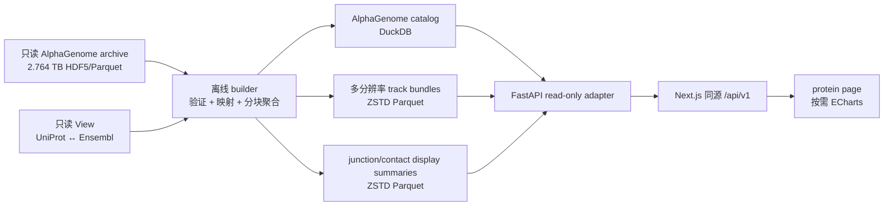

# AlphaGenome 板块可行性与实施计划

状态：M14 已批准并进入实现；pilot、catalog、API 和 protein-page vertical slice 已完成，全量 display bundle 正在离线构建。  
日期：2026-08-16

## 1. 决策

**可以加入现有网站展示，但不能把 2.764 TB 原始预测直接并入现有
`memvar_core.duckdb`，也不能让浏览器或普通 protein-page 请求扫描完整 HDF5。**

推荐方案是：

1. 将现有 AlphaGenome 目录注册为新的只读上游数据源；
2. 离线生成膜蛋白到 Ensembl gene/tile 的轻量目录、track metadata、统计摘要和多分辨率显示金字塔；
3. 生成结果写入 `website/data/generated/alphagenome/`；
4. protein 页面只通过同源 `/api/v1` 按 protein、tile、modality、context 和视窗读取有界数据；
5. 第一版把内容明确命名为 **AlphaGenome regulatory landscape prediction**，不称为实验数据，也不称为 variant effect；
6. 真正的 variant effect 必须来自 REF/ALT 两次预测或官方 scorer，作为后续独立阶段处理。

因此本计划的结论是 **conditional go**：技术上可行、覆盖率足够高，但必须先完成数据源契约补充、显示层预聚合和使用条款复核。直接合库、直接读原始矩阵和在线即时推理均不进入第一版。

## 2. 为什么值得加入

AlphaGenome 接受最长 1 Mb DNA 序列，并预测表达、转录起始、染色质可及性、组蛋白修饰、剪接和染色质接触等调控信号。官方论文描述了 11 类输出；多数一维输出可达到 1 bp，ChIP 类输出为 128 bp，contact map 为 2,048 bp 分辨率。参见 [AlphaGenome 论文](https://www.nature.com/articles/s41586-025-10014-0) 和 [官方 output metadata](https://www.alphagenomedocs.com/exploring_model_metadata.html)。

它对 memVar 的价值不是替代现有 HPA、GTEx、QTL 或变异证据，而是增加一个**模型预测层**：

- 在同一 1 Mb 基因组上下文中查看多个组织/细胞环境的预测调控信号；
- 把 expression、chromatin、splicing 和 3D contact 作为可解释的并列模态；
- 为后续已收录变异的 REF/ALT regulatory effect 预测预留接口；
- 让 QTL 和非编码变异附近的候选机制有可视化落点。

AlphaGenome 官方也说明，variant effect 是通过比较 REF 与 ALT 序列的预测结果得到，而不是从单份 reference track 自动推断；详见 [variant scoring 说明](https://www.alphagenomedocs.com/variant_scoring.html)。

## 3. 本地数据审计

上游目录：

```text
/media/xuyzh/Newsmy/alpha-predict/alphagenome_1mb_by_gene
```

截至 2026-08-16 的只读盘点：

| 项目 | 实测结果 |
|---|---:|
| 文件数 | 46,285 |
| 总字节数 | 2,764,008,820,308 bytes，约 2.76 TB / 2.51 TiB |
| Ensembl gene 目录 | 7,637 |
| 1 Mb tiles | 7,746 |
| 多 tile genes | 47 |
| 单 gene 最大 tile 数 | 5 |
| memVar 膜蛋白 | 7,728 |
| 可由稳定 Ensembl gene ID 命中预测的膜蛋白 | 7,430（96.14%） |
| 有 Ensembl 映射但完全无预测 | 64 |
| 无 Ensembl gene 映射 | 234 |
| 命中多个预测 gene 的蛋白 | 28 |

映射覆盖率足以支持 protein-page 板块，但 28 个 one-to-many 情况必须保留 gene selector，不能取第一个匹配。

### 3.1 本地数据不是官方全部输出

本地 archive 当前保存 9 个输出组：

| 本地 modality | 单 tile 形状/分辨率 | track 数 |
|---|---:|---:|
| RNA-seq | 1,048,576 × 113，1 bp | 113 |
| CAGE | 1,048,576 × 34，1 bp | 34 |
| PRO-cap | 1,048,576 × 2，1 bp | 2 |
| ATAC-seq | 1,048,576 × 19，1 bp | 19 |
| Histone ChIP-seq | 8,192 × 135，128 bp | 135 |
| Splice sites | 1,048,576 × 4，1 bp | 4 |
| Splice-site usage | 1,048,576 × 122，1 bp | 122 |
| Contact maps | 512 × 512 × 2，2,048 bp | 2 |
| Splice junctions | 稀疏 Parquet；EGFR 示例 10,107 × 61 | 61 contexts |

官方当前列出 11 类输出。本地目录没有 DNase 和 transcription-factor ChIP，并且每类 track 数也少于官方完整目录，因此网站必须写“**local selected AlphaGenome outputs**”，不能宣称展示完整 AlphaGenome 输出空间。

### 3.2 单 tile 也不适合直接返回

EGFR `ENSG00000146648/tile_000` 的实测值：

- `regular_tracks.h5`：343,665,986 bytes；
- `splice_junctions.parquet`：797,958 bytes；
- 解压为 API float32 后约 1.242 GB；
- 单独从 HDF5 读取完整 1 bp RNA-seq channel 的本地抽样约 1.19 秒；
- 聚合到 2,048 bins 后只有 4,096 个 mean/max 数值，float32 payload 为 16 KB。

这证明瓶颈主要在原始 HDF5 读取和读放大，而不是图形本身。预聚合后数据量可下降数个数量级。

### 3.3 当前 archive 的语义

现有 manifest 记录的是 GRCh38 reference interval 的预测，包含 model window、checkpoint、run ID、输出形状和 track metadata。它没有为每个 memVar variant 保存成对的 REF/ALT prediction 或 variant scorer 结果。

因此第一版只能展示：

> 对参考基因组序列的 AlphaGenome 调控轨道预测。

第一版不得展示或暗示：

- 某个变异导致表达升高/降低；
- 某个变异具有 AlphaGenome pathogenicity；
- reference track 的峰值就是 variant effect；
- AlphaGenome 预测等同于 HPA、GTEx、ENCODE 等实验测量。

### 3.4 已完成的 pilot 实测

首轮 pilot 原子发布了 19 个代表性 tiles、15 个 genes，派生目录约 124 MB；
catalog 同时覆盖全部 7,637 genes、7,746 tiles、492 tracks 和全部膜蛋白映射状态。
EGFR、负链、多 tile、one-to-many、无预测和无 Ensembl 六类路径均已进入自动化测试。

本地同源 API 的 EGFR 实测如下：

| 响应 | 大小 | 本地响应时间 |
|---|---:|---:|
| summary | 1.1 KiB | 39.6 ms |
| 4,096-bin signal | 179.4 KiB | 37.1 ms |
| 200 junctions | 23.7 KiB | 25.1 ms |
| 128 × 128 contact map | 242.9 KiB | 24.1 ms |

这些结果满足首版的 250 KiB 有界响应目标。全量 7,746-tile display bundle
采用相同格式离线生成；发布前继续保留 pilot，避免运行时读取半成品。

## 4. 不采用的方案

| 方案 | 决策 | 原因 |
|---|---|---|
| 全量写入 `memvar_core.duckdb` | 拒绝 | 破坏 core store 的轻量用途，文件不可部署，查询和备份代价过大 |
| protein 请求直接读取 2.764 TB archive | 仅允许开发诊断 | 单 channel 已有明显读放大；生产运行依赖外置磁盘和目录结构 |
| 浏览器接收 1,048,576 points | 拒绝 | payload、内存、hover 和缩放均不可控 |
| 每个 gene/track 预生成 PNG | 拒绝 | 组合数过大，失去筛选、缩放和 tooltip |
| 第一版转换全基因组 BigWig/JBrowse | 暂缓 | 数据是 gene-centered overlapping tiles，不是无缝全基因组 track；重叠窗口预测不能随意拼接 |
| 页面请求时调用 AlphaGenome API/GPU | 拒绝 | 延迟、配额、可重复性和失败面都不适合普通页面请求 |

官方 SDK 也说明 API 更适合数千次规模的中小型分析，而不是超过百万次的大规模作业；见 [AlphaGenome API README](https://github.com/google-deepmind/alphagenome)。本地已有完整预测 archive，因此网站运行时不应依赖外部 API。

## 5. 推荐架构



### 5.1 数据边界补充

现有 `AGENTS.md` 规定网站数据来源为 `View/`，而 AlphaGenome archive 位于 `View/` 外。实现 M14 前必须在 `AGENTS.md`、roadmap 和 source registry 中批准一个窄化例外：

- `ALPHAGENOME_SOURCE_ROOT` 是新的只读、版本化上游；
- builder 可读 `View/Basic_info` 和该 source root；
- 不修改、不重排、不向 source root 写缓存；
- 所有网站派生物只写 `website/data/generated/alphagenome/`；
- production API 第一版只读派生物，不要求挂载 2.764 TB source root；
- source root 路径、checkpoint revision、run ID 和 reference build 进入 source registry/manifest，但不暴露本机绝对路径给浏览器。

这项契约变更是实现的 blocking gate，不能靠代码中的隐式路径绕过。

### 5.2 生成目录

```text
website/data/generated/alphagenome/
├── alphagenome_catalog.duckdb
├── tracks/
│   └── ENSG.../tile_000.parquet
├── junctions/
│   └── ENSG.../tile_000.parquet
├── contacts/
│   └── ENSG.../tile_000.parquet
└── build_manifest.json
```

不创建新的 SHA inventory 或独立 QC 报告。builder 只使用上游已有 manifest、`_SUCCESS`、shape、coordinate 和 metadata 行数做必要 contract assertion，并在失败时停止。

### 5.3 Catalog 表

`alphagenome_gene_coverage`

```text
uniprot_accession
ensembl_gene_id
mapping_status                 # exact / ambiguous / unavailable
mapping_count
gene_symbol
hgnc_id
chromosome
gene_start_1based
gene_end_1based_inclusive
gene_strand
num_tiles
has_prediction
```

`alphagenome_tile`

```text
ensembl_gene_id
tile_id
tile_index
window_start_0based
window_end_0based
core_start_0based
core_end_0based
window_anchor
window_width
model_checkpoint_revision
run_id
```

`alphagenome_track`

```text
track_id                       # modality + source column index 的稳定派生 ID
modality
source_column_index
name
assay_title
ontology_curie
biosample_name
biosample_type
biosample_life_stage
gtex_tissue
strand
histone_mark
data_source
source_resolution_bp
display_unit
```

Track 仍保留 source column index，因为它与 HDF5 column 的对应关系是事实。`track_id` 只作为网站稳定键，不用展示名参与 join。

### 5.4 多分辨率显示金字塔

第一版建议生成三个有界级别：

| level | 每个 1 Mb tile bins | 用途 |
|---|---:|---|
| overview | 256 | 卡片预览/快速切换 |
| standard | 1,024 | 默认展开视图 |
| detail | 4,096 | 放大后的细节视图 |

一维非负 signal 每个 bin 保存 `mean` 和 `max`：`mean` 保留整体趋势，`max` 避免窄峰被平均抹去。splice-site probability 等有明确范围的数据保留相同原始尺度。不得跨 assay、modality 或 biosample 做 z-score 后再伪装成原值。

粗略上界：429 个一维 dense tracks、7,746 tiles、三个 level、mean/max、float16 在未压缩时约 72 GB；ZSTD 后预计为原始 2.764 TB 的小部分。该数字只是容量规划估计，必须先以 20 个不同长度和信号密度的 tiles 做 pilot benchmark，再冻结实际格式和全量预算。2 个 contact-map tracks 另按 `128 × 128` display matrix 估算，不计入这个一维上界。

Splice junction 第一版不展开为超大 long table：为每个 `tile × context` 预计算当前显示所需的 top-K junction，并保留原始 start/end/strand/value。Contact map 第一版预聚合为 `128 × 128`，按 context 懒加载；原始 `512 × 512` 仅在后续性能与容量允许时开放。

### 5.5 构建要求

- 按 tile 流式读取 HDF5 chunk，不一次加载全部 modalities；
- builder 在隔离的临时目录逐 tile 写入；`--resume-root` 只复用 signal、junction、contact 三个 Parquet 均通过 footer/schema/row-count 校验的完整 tile，不完整 tile 自动重建；
- 中断时保留 staging，完成后才原子发布最终目录，未完成文件不能被 API 看见；
- 只对 `has_prediction=true` 的稳定映射 gene 生成网站数据；
- gene tile 重叠区不做数值平均；overview 只使用各 tile 的 core 区，点击后进入具体 1 Mb window；
- one-to-many accession 保留全部 Ensembl genes；
- 坐标转换集中在 builder/API，前端不自行猜测 0/1-based；
- 先完成 EGFR、一个负链 gene、一个多 tile gene、一个 one-to-many protein、一个无预测 protein 的 pilot。

## 6. API 契约

浏览器继续只访问 Next.js 同源 `/api/v1`，不增加第二套 host/port 配置。

### 6.1 Summary

```http
GET /api/v1/proteins/{acc}/alphagenome/summary
```

返回：

- availability、prediction kind=`reference_sequence_tracks`；
- accession 对应的全部 Ensembl gene candidates；
- selected gene、gene/tile coordinates、strand 和 GRCh38；
- 本地可用 modalities、track/context counts；
- model/checkpoint/run、local subset 标记和用户提示；
- `has_variant_effect_scores=false`。

初始 protein 页面只请求该 summary，不读取 chart values，也不加载 ECharts。

### 6.2 Track catalog

```http
GET /api/v1/proteins/{acc}/alphagenome/tracks
    ?ensembl_gene_id=ENSG00000146648
    &modality=rna_seq
```

返回当前 protein/gene/modality 可选的 biosample、assay、strand、histone mark、source 和 track IDs。筛选项来自 metadata，不硬编码统一 tissue 列表。

### 6.3 一维轨道

```http
GET /api/v1/proteins/{acc}/alphagenome/signals
    ?ensembl_gene_id=ENSG00000146648
    &tile_id=tile_000
    &track_id=...
    &start=54590935
    &end=55639511
    &bins=1024
```

约束：

- `start/end` 在 API 内固定为 GRCh38 0-based half-open，response 同时给出 display 1-based labels；
- `bins` 只接受白名单 256/1024/4096，并由服务端选择不低于请求视窗所需的 level；
- 单个 API 响应固定返回 1 条一维 track；前端可并发选择最多 5 条跨 modality tracks 做对比；
- response 含 mean/max、unit、source resolution、aggregation、track metadata；
- 单响应目标小于 250 KB，禁止返回百万点。

### 6.4 Junction 与 contact map

```http
GET /api/v1/proteins/{acc}/alphagenome/junctions
    ?ensembl_gene_id=...
    &tile_id=...
    &track_id=...
    &start=...
    &end=...
    &limit=200

GET /api/v1/proteins/{acc}/alphagenome/contact-map
    ?ensembl_gene_id=...
    &tile_id=...
    &track_id=...
    &size=128
```

- junction 只返回当前窗口、阈值后 top-K，响应说明 truncated/available count；
- contact map 最大 `128 × 128`，返回矩阵范围、resolution 和颜色域建议；
- 两者均独立 loading/error/empty，失败不影响其他 AlphaGenome tabs。

第一版不提供 raw HDF5 下载、不提供 POST export、不提供在线 inference endpoint。

## 7. 页面与交互

在 protein 页面新增独立导航：

```text
AlphaGenome · predicted regulatory landscape
```

建议放在 QTL 之后、Interactions 之前，以保持“实验表达/QTL → 模型调控预测 → 分子互作”的阅读顺序。

### 7.1 折叠前摘要

默认只显示：

- `Predicted` badge；
- mapped Ensembl gene、GRCh38 locus、tile 数；
- 可用模态：Expression / Chromatin / Splicing / 3D contact；
- 一句话提示：“Reference-sequence model prediction; not an experimental measurement or variant-effect score.”；
- `Explore predictions` 按钮。

没有映射时显示原因：`no Ensembl mapping` 或 `no local AlphaGenome prediction`，不显示空图。

### 7.2 展开后的结构

```text
Gene selector（仅 one-to-many 时出现）
Tile overview / Tile selector（仅多 tile 时出现）
Modality tabs
  ├── Expression: RNA-seq / CAGE / PRO-cap
  ├── Chromatin: ATAC / Histone ChIP
  ├── Splicing: sites / usage / junctions
  └── 3D contact
Context filters
Interactive chart
Prediction provenance + interpretation note
```

交互规则：

- 必须按 modality → biosample → track 的顺序筛选，避免把大量 context 混在同一个下拉框；
- 同一 gene 和 tile 下可保留最多 5 条跨 modality tracks；切换 biosample 或 modality 都不清空比较集；
- 不同 modality 按纵向轨道排列并共享 gene 区间和水平缩放，但各自保留独立纵轴与原始单位；同 modality 的不同 tissue 在同一行叠加；
- junction 和 contact map 裁剪到相同 gene 区间并作为纵向轨道继续展示；
- 不按 `nonzero_mean` 自动把某个 tissue 标成“最相关”；
- strand-aware modality 默认优先 gene strand，但 UI 始终显示当前 strand；
- Histone 必须继续选择 mark；同一 biosample 多 track 时不能静默取第一条；
- 一维轨道共用同一 genomic x-axis，hover 显示 coordinate、value、unit、aggregation、biosample 和 assay；
- zoom/pan 只触发有界 level 请求，旧请求要取消或忽略，防止快速切换时串图；
- contact map 使用 ECharts heatmap/canvas，按需动态加载；不引入 Plotly 或 JBrowse；
- 多 tile overview 只画 core 区并标注边界，绝不把重叠窗口预测平均成一条伪连续轨道。

### 7.3 视觉语义

- AlphaGenome 使用独立的 predicted-layer 色系，但保留全站 section palette 体系；
- modality 颜色只用于导航，不表达证据强弱；
- 同一图内 track 使用可区分且色盲友好的颜色；
- contact map 使用单调 sequential scale，不用彩虹色；
- 所有图提供文字表格/metadata 替代，键盘可操作；
- tooltip 和 legend 保留官方名称大小写，如 `RNA-seq`、`ATAC-seq`、`PRO-cap`。

## 8. 与现有板块的边界

| 现有板块 | AlphaGenome 可以做什么 | 不可以做什么 |
|---|---|---|
| Expression | 并列展示预测 expression tracks | 与 HPA/GEN/GTEx 数值求平均或作同一色标 |
| QTL | 在同一 locus 附近提供调控背景 | 把 QTL association 称为模型确认 |
| Variant | 后续链接真正的 REF/ALT score | 用 reference peak 代替 variant effect |
| Sequence | 从 protein 跳到对应 genomic gene window | 把 genomic bp 坐标画成 canonical amino-acid 坐标 |
| Disease | 提供机制假设入口 | 生成临床 pathogenicity 或跨来源综合分数 |

## 9. 使用条款与科学提示

AlphaGenome API、模型权重和输出具有非商业使用限制。官方 FAQ 还明确指出 AlphaGenome outputs 不应被用于训练其他机器学习模型；见 [官方 FAQ](https://www.alphagenomedocs.com/faqs.html)。

实现前必须完成以下复核：

1. 当前本地 checkpoint 对应的 model terms；
2. 对本地生成 predictions 的网站展示/再分发是否被允许；
3. 公开部署、下载和批量导出是否需要额外限制；
4. 页面引用 AlphaGenome 论文、模型版本和本地 run provenance；
5. 网站用途保持 non-commercial research，除非取得不同授权。

在复核完成前：

- 只允许本地研究门户展示；
- 不开放原始数组下载或批量导出；
- 不把预测作为临床诊断结论；
- 不用预测结果训练其他模型。

## 10. 分阶段实施

### M14-A：契约与 pilot（必须先完成）

1. 更新 `AGENTS.md`、roadmap、source registry，批准只读 AlphaGenome source root；
2. 建 catalog builder，完成 UniProt ↔ Ensembl exact mapping 和 one-to-many 状态；
3. 对 20 个代表 tiles 生成 256/1024/4096-bin pilot；
4. 测量 build throughput、压缩率、单 track payload 和 API 延迟；
5. 以实测值冻结全量容量预算和文件布局；
6. 完成 terms/redistribution review。

退出条件：EGFR、负链、多 tile、one-to-many、无预测五条路径均正确；预计全量派生物容量和构建时间已有实测依据。

### M14-B：Catalog + summary vertical slice

1. 生成全量 coverage/tile/track catalog；
2. 实现 summary 和 track catalog endpoints；
3. protein 页面加入折叠摘要、gene selector、tile selector和空态；
4. 初始加载不访问 signal files、不初始化 ECharts。

退出条件：7,728 个 protein 均返回 deterministic availability；7,430 个命中、64 个无 prediction、234 个无 Ensembl 的状态与离线审计一致。

### M14-C：一维 tracks

1. 全量构建 256/1024/4096 display pyramid；
2. 实现 signals endpoint 和 bounded caching；
3. 实现 Expression、Chromatin、Splice sites/usage tabs；
4. 完成 zoom、context filters、hover、loading/error/empty 和可访问替代。

退出条件：普通响应不超过 4,096 bins/track；页面从不读取原始百万点；快速切换 context 不串图。

### M14-D：Junction + contact map

1. 生成 junction top-K display summaries；
2. 生成 `128 × 128` contact display matrices；
3. 实现 sashimi-style junction 视图和 lazy contact heatmap；
4. 验证多 tile core/window 边界。

退出条件：junction 明确 truncated 状态；contact payload 有固定上限；任一子图失败不影响其他 tabs。

### M14-E：Variant effects（独立后续，不属于 reference-track 首版）

仅在用户另行批准且条款允许后进行：

1. 从 memVar 已收录且有可靠 GRCh38 REF/ALT 的变异中定义有界 target set；
2. 离线运行 AlphaGenome recommended scorers；
3. 保存 raw score、quantile score、scorer、track、gene、REF/ALT、interval、model revision；
4. 以独立 source-specific branch 加入 Variant，不生成综合 pathogenicity；
5. 页面请求绝不触发 GPU inference。

## 11. 验收与测试矩阵

### 数据契约

- 生成路径不在 `View/` 或 AlphaGenome source root 内；
- accession 只通过稳定 ID 映射，symbol 不自动造 join；
- one-to-many 全部保留并要求选择；
- HDF5 column index 与 metadata row count 一致；
- tile window、core 和 strand 坐标通过 contract assertion；
- 缺少 `_SUCCESS`、manifest、dataset 或 metadata 时 builder 失败，不产出半成品。

### API

- 非法 accession、gene、tile、track、window 和 bins 返回明确 4xx；
- response 始终包含 genome build、coordinate convention、unit、aggregation 和 prediction kind；
- summary 小于 100 KB；signal 单响应目标小于 250 KB；contact 固定不超过 `128 × 128`；
- API 只读 generated artifacts，不扫描全部 archive；
- 同源 proxy 路径与现有 `/api/v1` 一致。

### UI

- EGFR 正常路径；
- 负链 gene 的 strand 与坐标显示；
- 多 tile gene 的 core overview 与 tile detail；
- one-to-many protein 的 gene selector；
- 无 Ensembl 与无 prediction 两种不同空态；
- modality/context 无组合时不发 signal 请求；
- 键盘、tooltip、legend、表格替代和窄屏可用；
- AlphaGenome 失败不影响 Overview、Variant、Expression、QTL 等现有板块。

### 科学语义

- 页面始终出现 `Predicted` 和 `reference sequence`；
- 本地 9 modality subset 不写成官方完整 11 modality；
- 不把 reference track 写成 variant effect；
- 不跨 modality 或实验/预测来源直接比较数值；
- 不输出临床解释、证据投票或综合 score。

## 12. 最终建议

AlphaGenome 非常适合成为 memVar 的一个**可折叠、按需加载、gene-centered 预测板块**，本地数据对膜蛋白的 96.14% 覆盖率也支持投入实施。

最稳妥的第一步不是立即开发完整浏览器，而是先执行 M14-A：用 20 个 tiles 验证 display pyramid 的真实容量和速度，并补齐 source/terms 契约。通过后再按 summary → 一维 tracks → junction/contact 的顺序增加功能。

最终架构应保持：

```text
2.764 TB read-only prediction archive
        ↓ offline, streaming build
lightweight catalog + bounded display pyramids
        ↓ read-only /api/v1
protein-page AlphaGenome panel
```

这能把大数据量控制在现有 Next.js + FastAPI + DuckDB + Parquet + ECharts 架构内，同时保留 AlphaGenome 的多模态价值、模型来源和科学解释边界。
