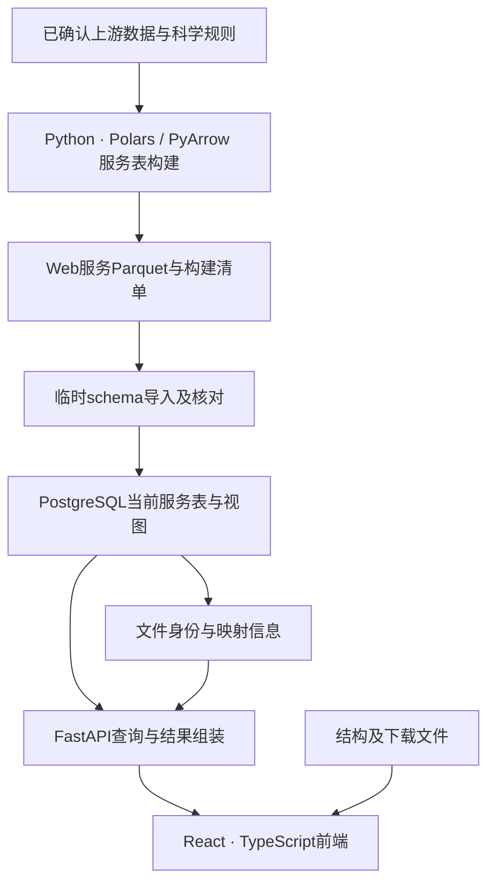

# 已确认的网站架构与工具

> 00阶段方案基线，2026-09-22归档。保留原方案与当时状态；适用范围、01阶段修订及未替代契约见[现行方案索引](../../../../plan/README.md)。旧阶段授权/待执行文字不作为当前指令。

确认日期：2026-09-21。决策背景与当前顺序见[策划入口](README.md)。本页是memVar的采用决定，不代表参考网站真实使用同一架构。

## 1. 架构和职责

| 层次 | 负责内容 | 边界 |
| --- | --- | --- |
| 科研整理 | 收录、序列/位点映射、证据含义、分类及科学统计规则 | Web不重新推断；已确认输入例外沿用对应契约 |
| 服务表构建 | 从指定快照选择数据、整理服务字段、落实已确认关联与无损精简 | 不按页面需要静默改变科学关系，不混用不一致来源快照 |
| PostgreSQL | 保存实体和关系、约束、筛选、分页、索引及普通视图 | 不将每个页面模块分别复制成一套事实表 |
| API | 参数校验、统一查询、对象组装、来源与状态返回 | 不在请求中重跑科研流程，不直接暴露全部数据库列 |
| 前端 | 从API选取信息、布局、交互、图形和可复现查询入口 | 不重算科学分类，不把条目/基因背景冒充isoform特异结论 |

## 2. 数据构建和存储

- 继续使用现有Python、Polars、PyArrow及Parquet产物，不为网站引入第二套科研清洗流程。字段和关联先确认，再构建、核对及入库。
- PostgreSQL延续现有17系列部署；当前连接、COPY、约束、索引、视图与事务替换方式由[PostgreSQL方案](../postgresql.md)维护，不因架构规划自动升级主版本。
- 常用身份、关联键、坐标、筛选和排序字段用明确的标量列；证据、条件、反应参与物等嵌套详情可用JSONB。需要频繁关系查询或外键约束时再将相关嵌套关系拆表，不把全部信息装进一个大JSON。
- 实体属性尽量由实体表维护；关系表保存对象、关系、证据和必要来源。已确认的重复属性通过普通视图恢复；物化视图或预计算仅用于实际昂贵且口径已确认的查询。
- 原始结构、大型下载文件等保留为文件，数据库保存文件身份、版本、受控位置和必要关系。具体静态资源服务或对象存储在部署阶段按需求确定。
- 逐板块建设与发布原子性分开考虑。当前整体临时schema切换可继续使用，不要求为了逐板块前端而改成逐表替换；未来局部发布须连同依赖、外键和视图共同设计。

选择理由：现有数据已形成Parquet及关系表体系；PostgreSQL适合蛋白、基因、序列、来源实体之间的关联与在线过滤。当前规模没有单独支持引入分布式数据库的必要性；后续依据真实查询与负载证据扩展。

依据：[COPY](https://www.postgresql.org/docs/17/sql-copy.html)、[JSONB](https://www.postgresql.org/docs/17/datatype-json.html)。

## 3. 后端采用一个按业务模块组织的服务

采用 **FastAPI + Pydantic + SQLAlchemy Core + psycopg**。

| 工具 | 职责与理由 |
| --- | --- |
| FastAPI | Python API服务，沿用现有Python开发背景，支持明确的请求/响应模型及OpenAPI文档 |
| Pydantic | 校验参数和返回结构，明确可空字段、对象类型和状态，减少前后端理解差异 |
| SQLAlchemy Core | 组织参数化和可组合的SQL查询；按科研查询需要使用关系连接，不强制将全部服务表包装成复杂ORM对象 |
| psycopg | PostgreSQL驱动；连接池由SQLAlchemy统一管理，不再嵌套一套独立连接池 |

代码按身份/序列、功能通路、定位、膜、变异、context、疾病等实际业务分模块，复用身份解析、来源和查询工具；统一部署为一个后端服务。复杂性首先来自生物学对象和关系，当前拆成多个独立微服务会增加跨服务一致性及运维成本。

API使用只读数据库角色；数据构建/导入使用独立入口和权限。耗时科研构建不在网页请求中执行。模型/查询代码、API返回模型和Parquet字段契约相互对应，但不要求完全同形。

依据：[FastAPI](https://fastapi.tiangolo.com/features/)、[SQLAlchemy Core](https://docs.sqlalchemy.org/en/20/core/)、[psycopg](https://www.psycopg.org/psycopg3/docs/)。

## 4. API采用REST/JSON与OpenAPI

按研究对象和查询任务提供接口，不以“一张表一个接口”为原则。一个身份接口可组装蛋白、基因及默认序列；GO、变异和位点等大列表单独查询，避免一个接口返回全部注释。具体路径、参数与字段仍待对应板块设计，不把本次概念示例视为已实现API。

共同要求：

- 明确gene、entry、isoform、processed product及结构对象；页面归属accession不能替代实际注释对象。
- 涉及位点时给出明确sequence_id/参考版本；涉及结构时保留模型、链、编号体系及插入码。仅背景关联与精确位置映射分别表达。
- API格式版本、服务data_version与来源自身版本分别记录。当前不保存全部历史Web快照；链接携带旧版本不等于保证旧数据可重新查询。
- 过滤、排序、分页和导出共用已确认的查询条件。大表由服务端分页；深分页评估游标方式，排序包含稳定且可消歧的键。
- 数据缺失、未接入、未映射、不适用和真实零分开；空结果不等于接口失败。
- 长字段和详情按需要请求；主键、来源和科学限定信息不得因截选而丢失其含义。
- OpenAPI作为前后端接口契约，后续可由其生成TypeScript类型或客户端，减少手工维护两套字段定义。

REST适合当前明确的蛋白、序列、变异和结构查询任务，便于公开文档、测试及科研脚本调用；第一版不引入GraphQL。缓存必须考虑参数、对象和数据版本，发布后不能将旧缓存与新数据拼接。

## 5. 前端方法与工具

采用 **React + TypeScript + React Router + Vite**，数据探索部分以浏览器交互为主。当前确认工具方向，不确认具体布局或前端字段截选。

| 任务 | 采用方向 | 理由与边界 |
| --- | --- | --- |
| 页面与路由 | React、TypeScript、React Router、Vite | 模块化组件，管理对象入口与查询参数；具体SSR/预渲染范围按公开页面检索需求在实现前确定 |
| 服务数据请求 | TanStack Query | 集中处理请求、缓存、加载、错误及失效；缓存键包含对象、条件和数据版本 |
| 表格 | TanStack Table | 组织列、排序和选择，大数据筛选/分页由后端执行，不把全表下载到浏览器 |
| 基础交互组件 | shadcn/ui按需采用 | 统一按钮、菜单、对话框等行为，可维护源码；具体配色、排版后续确定 |
| 序列与轨道 | 优先适配Nightingale | 使用生命科学组件，先验证坐标、范围、事件与性能，再决定自定义部分 |
| 结构 | 优先适配PDBe Molstar | 复用成熟分子展示器，项目负责可靠的模型/链/残基映射；不能直接用蛋白位置当PDB编号 |

状态职责分开：URL保存可分享的对象与已应用筛选；TanStack Query维护API数据；页面共享状态维护当前位点、变异及模型选择。多个入口使用同一份详情和选择逻辑。序列/结构组件按需加载，模型切换后重新检查映射，不能沿用旧结构位置。

首页、方法及帮助内容可按需求预渲染；若蛋白详情的完整搜索引擎收录是必要目标，应在前端启动前明确渲染方案。选择SPA不等于已经满足所有公开检索需求。

依据：[React Router SPA](https://reactrouter.com/how-to/spa)、[TanStack Query](https://tanstack.com/query/latest/docs/framework/react/overview)、[TanStack Table](https://tanstack.com/table)、[shadcn/ui](https://ui.shadcn.com/docs)、[Nightingale](https://github.com/ebi-webcomponents/nightingale)、[PDBe Molstar](https://github.com/molstar/pdbe-molstar)。

## 6. 验证与部署方向

- pytest用于查询语义、API契约及必要回归；Playwright用于关键用户路径。针对实际变更验证，不新建额外复杂QC体系。
- Docker Compose管理数据库、API及静态前端/反向代理等运行单元。域名、HTTPS、资源限额、备份恢复及公开访问配置在部署阶段落实；当前策划不执行部署。
- 不首期引入Redis、Celery、专用搜索引擎或微服务。出现持续慢查询、大导出或在线长任务时，先核对查询和索引，再按证据增加所需能力。

部署工具依据：[Docker Compose](https://docs.docker.com/compose/)。
